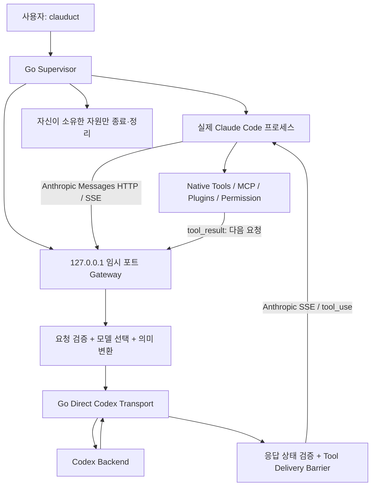
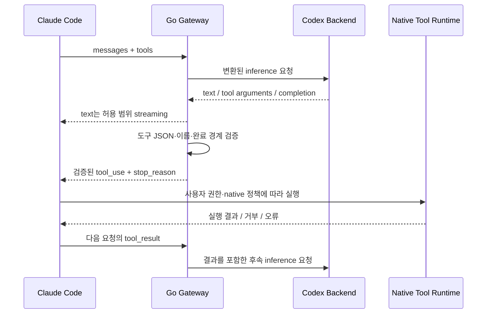

# 세션 34 — Clauduct Go V2: Native Host 보존 재설계·이관·개발 착수 판단

> **이 문서를 전달받은 Claude 개발 에이전트에게**
>
> 기존 Clauduct를 읽고, **Go로 처음부터 독립 구현할 V2의 설계와 파일 이관 계획을 검증하라.** Node V2를 먼저 만들거나 기존 Node 구현을 점진적으로 Go로 치환하는 계획으로 되돌리지 마라. 먼저 저장소의 실제 상태와 선행 결정을 확인하고, 본 설계의 타당성·누락·위험을 판정해 실행 가능한 개발 계약으로 고정하라.
>
> 이번 세션의 기본 실행 범위는 **현황 확인 → 설계 검증 → 전수 파일 처분표 → 비교·검증 계획 → 착수 판단 → 후속 구현 작업 패키지 작성**이다. 이 문서에 구현·이동 명령이 있더라도 그 자체가 즉시 구현, 파일 이동, 실모델 호출, 설치 변경, 배포를 허가하지 않는다. 사용자가 별도로 구현 실행까지 위임한 경우에만 해당 게이트 이후의 작업을 진행한다.

---

## 0. 문서 식별과 사용 방법

| 항목 | 값 |
|---|---|
| 파일명 | `2026-09-16-session-34-go-v2-native-host-redesign-handoff.md` |
| 선행 핸드오프 | `docs/prompts/2026-09-16-session-33-shipping-criteria-reconciliation.md` |
| 대상 저장소 | `wotjr1649/Clauduct` |
| 아키텍처 세대 | V2 — Go Native-Host-Preserving Bridge |
| 기본 작업 모드 | `ASSESS_AND_DESIGN` |
| 구현 언어 결정 | **Go 확정. Node V2 선행 구현 없음.** |
| 기존 Node 구현의 역할 | 변경하지 않는 비교 기준·프로토콜 근거·회귀 지식 |
| 이번 문서의 권고 | **설계·타당성 검토 GO / 구현 착수 조건부 GO / 기본 전환·출하 미승인** |
| 실모델 검증 예산 기본값 | **0회. 새 사용자 예산 승인 없이는 증가시키지 않음.** |
| 문서 날짜 해석 | 파일명의 `2026-09-16`은 사용자가 지정한 세션 연속 식별자다. 이 문서의 공개 자료 확인 기준일은 `2026-09-15`다. |
| 현재 증거의 한계 | 공개 문서·주요 소스는 확인했으나, 사용자의 로컬 전체 트리·미추적 파일·현재 HEAD·설치 환경을 검증하지 않았다. |

### 0.1 이 문서가 확정하는 것

Go-first, 기존 구현 보존, 단일 명령 실행, native Claude Code 사용, 독립 비교, 실호출 예산 통제, 근거 기반 승격을 확정한다. **Go를 사용할지 다시 투표하는 문서가 아니다.** 다만 특정 기능을 Go로 구현하는 데 실제 장애가 있으면 장애·대안·증거를 보고한다.

### 0.2 이 문서가 아직 확정하지 않는 것

실제 분기 기준 SHA, 작업 디렉터리, 설치된 Claude/Codex/Go 버전, 전체 파일 목록, 현재 통과 테스트, 새로운 실호출 예산, 최종 릴리즈 번호, 배포·PATH 변경 권한은 로컬에서 확인하거나 사용자가 부여해야 한다. 과거 채팅의 경로·개수·점수를 현재 사실로 채우지 마라.

### 0.3 권장 읽기 순서

최초 검토에서는 0–4장, 7–11장, 24–25장, 29–31장과 부록 A를 먼저 읽어 scope·보존·승인 경계를 확인한다. 세부 구현 시에는 해당 작업 패키지와 12–23장의 관련 계약을 연결한다. 후속 세션마다 이 문서 전체와 모든 과거 보고서를 다시 읽는 것을 기본 절차로 만들지 않는다.

### 0.4 규범 표현

- **MUST / 금지**: 구현·검증의 필수 계약이다.
- **SHOULD / 권고**: 바꾸려면 구체적인 이유와 영향 검증을 남긴다.
- **PROPOSED / 제안**: 현재 설계안이다. 로컬 근거로 개선할 수 있다.
- **VERIFIED / 검증됨**: 식별 가능한 코드·환경·실행 증거가 있는 상태에만 사용한다.
- **UNKNOWN / BLOCKED / NOT_RUN**: 실패·성공과 구분한다. 미실행을 PASS로 바꾸지 않는다.

---

## 1. 사용자 의도와 해결해야 할 실제 문제

사용자가 원하는 최종 사용법은 다음 하나다.

```powershell
clauduct
```

이 명령을 실행하면 설치된 실제 Claude Code가 시작되고, 기존 사용자가 설정한 호스트 기능을 가능한 한 유지하면서 지원되는 모델 추론 요청을 Codex로 처리한다. 사용자는 별도 gateway 서버를 먼저 실행하거나, 포트를 기억하거나, 개발용 프로필을 매번 설정할 필요가 없어야 한다.

핵심은 **Claude Code를 새로 만드는 것**이 아니라 **Claude Code의 모델 연결부를 호환시키는 것**이다. UI·도구 실행·승인·MCP·플러그인·사용자 훅·스킬·worktree·세션 사용 경험을 Clauduct가 다시 소유하지 않는다.

### 1.1 이번 결정의 이유

Node로 V2 아키텍처를 먼저 구현하고 Go로 다시 작성하는 중복 경로를 제거한다. 이것은 두 번의 제품 구현을 계획하지 않겠다는 결정이지, 실제 토큰 사용량이 정확히 절반이 된다는 보장은 아니다. 개발 비용은 실제 수정·재시도·검증 기록으로 평가한다.

### 1.2 성공의 정의

성공은 실행 파일이 뜨거나 채팅 한 번이 끝나는 것이 아니다. 다음이 함께 성립해야 한다.

1. **사용 경험**: 단일 실행·자동 종료, 기존 Claude 설정과 CLI 의미 보존.
2. **연결 정확성**: 요청 모델·도구·응답·취소·오류 의미가 검증된 범위에서 유지됨.
3. **격리된 개발**: 새 Go 코드 때문에 기존 Node 기준선이 바뀌지 않음.
4. **증거**: 어떤 기능을 어떤 조합에서 검증했는지 재현 가능함.
5. **정직한 범위**: 미지원·미검증·상위 서비스 의존 기능을 명시함.

`Host behavior delta = 0`은 설계 지향점이지, 모든 기능에 이미 달성한 측정값이 아니다. 추론 모델이 달라지므로 자연어 출력·도구 선택까지 동일하다는 조건을 요구하지 않는다.

---

## 2. 선행 세션과 현재 자료를 해석하는 원칙

### 2.1 반드시 먼저 읽을 자료

로컬에서 실제 존재 여부를 확인한 뒤 아래 순서로 읽어라. 파일이 이동했으면 Git 이력·기존 인덱스로 정확한 후속 위치를 찾고, 동명이인을 임의로 대체하지 마라.

| 우선순위 | 자료 | 읽는 목적 |
|---|---|---|
| 1 | 현재 작업 범위에 적용되는 `CLAUDE.md`, `AGENTS.md` 및 상위 지침 | 권한·빌드·검증·작업 범위 |
| 2 | 직전 session-33 프롬프트 | 예산·기존 작업 보존·판정 권한 연속성 |
| 3 | `HANDOFF.md`와 그 문서가 지정하는 현행 상태 문서 | 과거 이력과 현행 기준 구분 |
| 4 | `docs/remaining-verification.md` | 현재 남은 필수·제외·사용자 검증 항목 |
| 5 | `docs/release-priority-assessment-2026-09-14.md`, `docs/local-use-release-decision.md` | 실제 제품 범위와 변경된 출하 기준 |
| 6 | `README.md`, `RELEASE.md`, `docs/native.md` | 공개 계약과 구현 대응 |
| 7 | `docs/claude-option-classification.md` | 기존 옵션 정책의 이유와 재검토 대상 |
| 8 | 실제 런처·gateway·protocol·transport 및 그 import closure | 이름이 아닌 실사용 의존성 |
| 9 | 기존 테스트·실행 로그 인덱스·CI·설치/패키징 코드 | 비교 기준과 경로 의존성 |
| 10 | OmniRoute `launch`와 Claude/Go 공식 문서 | 차용할 패턴과 현재 인터페이스 확인 |

선행 문서의 날짜·짧은 SHA·worktree 개수·테스트 개수는 **그 문서가 작성된 시점의 기록**이다. 로컬 현황으로 갱신하지 않은 채 새 설계의 현재 상태로 인용하지 않는다. [S01–S05]

### 2.2 이어받을 작업 제약

새 사용자 승인이 없는 한 피검증 Clauduct를 통한 실모델 호출은 하지 않는다. 기존 미추적 파일과 worktree는 보존한다. 테스트 어서션을 낮추거나 보호 도구를 우회해 통과시키지 않는다. 변경 파일만 개별 stage하며, 파괴적 Git 조작이나 원격 정리를 자동 실행하지 않는다. 출하 선언 권한은 사용자에게 남긴다. [S01]

이 제약을 V2 작업의 기본 운영 정책으로 적용한다. **실호출 0은 현재 개발 대화 자체를 중단하라는 뜻이 아니라**, 제품 검증을 위해 추가 Codex/Claude 추론을 발생시키지 말라는 뜻이다. `claude -p`, 실제 gateway smoke, search side query도 해당 예산에 포함한다.

### 2.3 다시 열지 않을 범위와 새로 확인할 범위

기존 Node 릴리즈에서 제외·이관한 장시간 무인 실행, 특정 자동 복구, 동적 링크 환경 제약 등을 단순히 “V2이므로 모두 필수”로 부활시키지 않는다. V2가 새 위험을 만드는 경우에만 새 요구 ID와 근거를 제시한다. 기존 출하 기준의 변경 이력은 원문을 유지하고 V2의 판정과 분리한다. [S02–S04]

새 Go 구현의 경로 처리·취소·인증 경계는 새 증거가 필요하다. 그렇다고 보호 정책이 막는 실험을 다른 도구로 우회하거나 사용자 승인 없는 보안 설정 변경을 해서는 안 된다.

session-33의 “새 문서를 만들지 않는다”는 지시는 당시 출하 상태의 중복을 정리하는 작업 범위에 속한다. 이번 사용자는 새 Go V2 설계 문서를 요청했다. 따라서 V2 문서를 만들 수 있지만, 기존 Node의 현재 출하 상태를 새 문서에 복제해 또 다른 기준으로 만들지는 않는다.

### 2.4 앞선 대화의 주장 중 그대로 가져오면 안 되는 것

| 기존 설명에 대한 보정 | 새 설계에서의 처리 |
|---|---|
| `--settings` 주입이 사용자 설정 전체 삭제와 같다는 설명 | 실제 Claude 설정 우선순위·병합을 확인한다. 주입의 영향과 전체 교체를 구분한다. |
| `--agents` 주입이 모든 사용자 agent를 없앤다는 설명 | 이름 충돌·우선순위·추가 동작을 구분한다. |
| 얇은 launcher면 모든 Claude 기능이 완전 호환이라는 설명 | host 진입 가능성과 모델 프로토콜·서비스 호환을 별도 검증한다. |
| `--remote-control` 같은 이름만으로 gateway 우회라고 확정 | 해당 native 버전의 실제 동작과 실행 위치를 확인한다. 이름 기반 추측으로 차단하지 않는다. |
| `/v1/models`가 존재하면 picker 설정이 불필요하다는 확정 | discovery 조건·인증·캐시·기존 picker 설정을 실측한다. |
| loopback이므로 모든 네트워크가 Clauduct 안에 갇힌다는 설명 | 지원 모델 추론 경로와 기타 native 통신을 구분한다. |
| Go면 Windows 종료·필터링 문제가 자동 해결된다는 설명 | 실제 콘솔·프로세스 트리·OS 보안 제품 조합에서 검증한다. |
| app-server 전체의 안정성을 과거 설명으로 확정 | 이번 범위에서는 사용하지 않는다. 후속 검토 시 그 시점 공식 계약으로 판단한다. |

Claude 공식 문서는 gateway를 통한 **non-Claude 모델 라우팅을 공식 지원하지 않는다고 명시**한다. 따라서 V2는 제3자 호환 구현이며, “Anthropic 공식 지원” 또는 “전체 기능 100% 보장”으로 설명하지 않는다. [S11–S14]

---

## 3. 결정 기록: 채택·유지·제외

| ID | 결정 | 이유 / 경계 |
|---|---|---|
| D01 | Go로 독립 V2를 바로 구현 | Node V2 후 재포팅 경로 제거 |
| D02 | 기존 Node 소스는 비교 기간 원래 위치에 보존 | 경로 변경으로 기준선이 달라지는 문제 방지 |
| D03 | Go 모듈은 `go/`, V2 설계는 `docs/v2/` | 임시 `next/`를 다시 옮기는 비용 회피 |
| D04 | 새 branch + 별도 worktree를 우선 사용 | 두 구현을 동시에 확인하되 작업 트리 혼선 최소화 |
| D05 | 제품 명령은 native 인자 pass-through | Claude CLI shadow parser를 만들지 않음 |
| D06 | Clauduct 개발 명령은 별도 실행 파일 | native `--help`, `--model`, 인자 값 충돌 방지 |
| D07 | ephemeral loopback gateway 유지 | 사용자가 서버를 관리하지 않는 UX |
| D08 | 초기 backend는 기존 direct Codex 경로의 Go 재구현 | host 재설계·언어 변경 외에 backend 종류까지 동시에 바꾸지 않음 |
| D09 | Claude가 유일한 일반 도구 실행자 | Go 또는 Codex가 Bash/Edit를 중복 실행하지 않음 |
| D10 | managed agent/hook 기능은 기본 launcher와 분리 | 선택적 기능이 기본 실행의 전제 조건이 되지 않음 |
| D11 | 언어 중립 fixture·scenario·trace를 비교 계약으로 사용 | 기존 Node의 버그까지 정답으로 복제하지 않음 |
| D12 | 실호출은 승인 전 0 | 기존 예산 경계 유지, offline-first |
| D13 | 기본 전환과 출하는 개발 착수와 별도 승인 | GO 설계를 출시 PASS로 혼동하지 않음 |
| D14 | 대규모 파일 이동은 비교 검증 이후 별도 단계 | 문서 정리가 제품 변경과 엉키지 않음 |

### 3.1 이번 V2의 비목표

범용 다중 공급자 gateway, 웹 대시보드, 상시 daemon, 다중 사용자 서비스, Claude Code UI 재구현, 자체 MCP host, 자체 파일·shell agent, 자동 OAuth 갱신/로그인, 모델별 무제한 fallback, Codex app-server 동시 도입, 기존 무인 작업 요구의 무조건 복원은 초기 범위에서 제외한다.

OmniRoute 전체를 포팅하지 않는다. 차용할 것은 **호스트에 적게 개입하는 실행 경계**다. 문서·코드를 실제로 복사한다면 해당 revision의 라이선스와 고지 의무를 먼저 확인한다. 공개 저장소라는 사실만으로 복제 권한을 추정하지 않는다.

---

## 4. 개발 가치와 진행 판단

### 4.1 사전 판단

**설계 작업은 GO다.** 사용자 목표와 기존 제약의 충돌을 줄이고, Node V2 없이 Go 단일 구현으로 검증할 명확한 가설이 있다.

**제품 구현은 조건부 GO다.** 조건은 언어 재선정이 아니라 다음 다섯 가지다.

| 조건 | 충족 증거 | 미충족 시 |
|---|---|---|
| 기준선 식별 | 정확한 commit, dirty 상태, 원래 실행 방법 | 비교 대상부터 확정 |
| Go 작업 공간 격리 | 충돌 없는 branch/worktree/새 파일 범위 | 기존 작업을 손대지 않고 경로 재설계 |
| 최소 호환 경로 검증 가능 | fake Claude + fake upstream fixture 계획 | 가장 작은 offline 실험부터 설계 |
| 인증·프로토콜 지식 확보 | 코드·테스트에서 필요한 계약 추출 | 실제 credential을 읽지 말고 모르는 부분 표시 |
| 평가 기준 명확 | 기능/안전/예산/이관 게이트 | 성공 정의부터 보완 |

**현재 이 문서는 구현 완료 또는 출시 준비를 증명하지 않는다.** Go 바이너리와 실제 native 조합을 여기서 실행한 적이 없다.

### 4.2 local Claude가 내려야 할 판정 축

단일 PASS/HOLD 대신 다음을 각각 판정한다.

```text
DESIGN:             GO | REVISE | BLOCKED
OFFLINE_BUILD:      GO | CONDITIONAL_GO | BLOCKED
LIVE_VALIDATION:    NOT_AUTHORIZED | GO_WITH_BUDGET | BLOCKED
DEFAULT_SWITCH:     NOT_REQUESTED | READY_FOR_USER_DECISION | BLOCKED
RELEASE:            USER_DECISION_REQUIRED
ARCHIVAL_MOVE:      DEFERRED | READY_FOR_USER_DECISION | BLOCKED
```

기존 Node의 현재 출하 상태를 이 표로 덮어쓰지 않는다. 새 V2 개발 상태와 기존 제품의 운영 상태는 서로 다른 축이다.

### 4.3 중단해야 할 실질적 사유

작업 루트가 불명확하거나, 변경 중인 기준선을 덮어써야 하거나, 타인의 프로세스·credential·보호 설정을 조작해야 하거나, 필수 실호출 예산이 없거나, 목표 기능이 공개된 native 계약으로 전혀 연결되지 않는 경우에는 그 단계만 BLOCKED로 보고한다. Go 선택을 취소하거나 안전 조건을 낮춰 우회하지 않는다.

---

## 5. 아키텍처 설계도: 실행과 요청 경로

아래 도면은 **목표 설계**이며 현재 구현 완료 상태가 아니다.



### 5.1 반드시 지킬 책임 경계

| 영역 | 주 소유자 | Clauduct의 허용 역할 |
|---|---|---|
| TUI, stdin/stdout, interactive key 처리 | Claude Code | 정상 연결·프로세스 상태 관찰 |
| Read/Edit/Write/Bash | Claude Code | 도구 정의와 호출·결과의 프로토콜 변환 |
| MCP·플러그인·스킬·사용자 훅 | Claude Code와 사용자 | 설정·환경·도구 의미 보존 |
| permissions·조직 정책 | Claude Code/조직 | 명시적 사용자 인자 전달, 권한을 확대하지 않음 |
| worktree·프로젝트 cwd | Claude Code/사용자 | 초기 cwd 보존, 자기 개발 worktree와 혼동 금지 |
| native session/resume | Claude Code | 과거 메시지 변환, 관련된 bridge 상태만 관리 |
| 모델 이름/effort 호환 | Clauduct | 명시적 registry와 검증된 mapping |
| API envelope·SSE 변환 | Clauduct | 한정된 계약·오류·취소·전달 경계 |
| loopback 생명주기 | Clauduct | 자동 시작·정리, 외부 상시 서비스 없음 |
| Codex 로그인·정상 credential 갱신 | 사용자/Codex 도구 | 허용된 저장소를 읽기 전용 사용, 실패를 알림 |
| Codex 추론 | backend | 호출 결과를 검증해 native에 전달 |

### 5.2 기본 launcher의 최소 역할

```text
현재 작업 디렉터리·인자·환경 수집
  → Claude 실행 경로 확인
  → 적용 가능한 최소 연결 설정 결정
  → loopback listener 바인딩 + 인증 token 생성
  → gateway readiness 확인
  → native Claude 시작
  → native 종료·치명적 오류 관찰
  → owned 요청 취소 / HTTP·socket·child 정리
  → native exit 결과와 cleanup 결과를 분리해 반환
```

포트는 운영체제가 선택한다. 먼저 빈 포트를 탐색해 닫은 뒤 재바인딩하는 race를 만들지 않는다. listener를 확보한 뒤 실제 bound address를 child에 넘긴다.

### 5.3 정상 도구 왕복



Go가 도구를 직접 실행하거나 Claude 대신 승인을 답하는 단계는 없다. 단, 기존 bridge의 hosted search처럼 **서버 측 검색 기능을 변환하는 특수 경로**는 일반 도구와 구분해 별도 capability로 설계한다. [S06–S09]

---

## 6. OmniRoute에서 채택할 것과 채택하지 않을 것

확인한 OmniRoute launcher는 native Claude 실행과 인자 전달을 중심으로 endpoint·인증·discovery 환경을 조정한다. 이것이 이번 재설계의 참고 패턴이다. 다만 launcher의 얇음 자체는 protocol의 완전 호환 증명이 아니다. [S10]

| 구분 | 채택 여부 | Go V2 방식 |
|---|---|---|
| native executable 그대로 실행 | 채택 | stdio/cwd/인자 의미 유지 |
| unknown native args 전달 | 채택 | wrapper가 Claude 문법을 재구현하지 않음 |
| 사용자 환경의 광범위 보존 | 채택하되 신뢰 경계 명시 | inference 제어 변수만 최소 조정 |
| 사용자 기본 프로필 사용 | 채택 | 기본 실행에서 별도 `CLAUDE_CONFIG_DIR` 강제하지 않음 |
| model discovery 이용 | 검증 후 채택 | 인증·캐시·picker 상호작용 포함 |
| 별도 gateway를 사용자가 먼저 실행 | 채택하지 않음 | Go가 ephemeral gateway를 소유 |
| 일반 shell을 통한 무제한 인자 연결 | 채택하지 않음 | native exe 우선, 안전하게 검증된 fallback만 |
| 다중 provider·dashboard·account rotation | 초기 범위 제외 | Codex 호환에 집중 |
| 불명확한 tool arguments 보정 | 무조건 채택하지 않음 | 실제 요청 schema·의도에 근거한 최소 변환 |

### 6.1 중요한 차용 원칙

**host integration은 얇게, wire validation은 엄격하게** 한다. 이는 호스트를 통제하지 않기 위해 프로토콜 오류를 묵인하라는 뜻이 아니다. 반대로 엄격한 프로토콜을 만들기 위해 모든 native 옵션을 선제적으로 막으라는 뜻도 아니다.

---

## 7. 저장소·브랜치·worktree 구조

### 7.1 권장 개발 배치

실제 경로는 로컬에서 확인한다. 아래는 예시이며 사용자의 현재 경로라고 단정하지 않는다.

```text
<workspace-parent>/
├── Clauduct/                 # 기존 작업 디렉터리: 그대로 보존
└── Clauduct-go-v2/           # 새 linked worktree
    └── branch: redesign/go-v2-native-host
```

두 worktree는 별도 작업 트리·index를 갖지만 Git 객체·일부 설정·refs를 공유한다. “원본이 별도 폴더이므로 무조건 안전하다”고 가정하지 말고 기준선 해시·작업 트리 상태를 확인한다. [S19]

### 7.2 새 worktree 안의 목표 구조

```text
Clauduct-go-v2/
├── .git                      # Git이 관리하는 linked-worktree 파일; 직접 편집 금지
├── .gitignore                # V2 생성물 ignore만 검토 후 최소 추가
├── .github/workflows/        # 기존 Node job 유지 + 별도 Go job
│
├── bin/                      # 기존 Node: 초기 이동·수정 금지
├── src/                      # 기존 Node: 초기 이동·수정 금지
├── poc/                      # 기존 Node: production 의존성 포함, 보존
├── verification/             # 기존 Node 검증 + runtime 의존성 포함, 보존
├── clauduct.cmd              # 기존 설치/실행 경로 보존
├── install.ps1               # 기본 전환 승인 전 변경 금지
├── README.md                 # 기존 제품 설명 보존; V2 안내 최소 추가만 허용
├── HANDOFF.md                # 현행 Node 상태를 V2 상태로 덮어쓰지 않음
├── RELEASE.md                # Node 출하 이력 보존
│
├── go/                       # 독립 Go module: 제품 구현 유일 위치
│   ├── go.mod
│   ├── go.sum                # 의존성이 발생하면 관리
│   ├── cmd/
│   │   ├── clauduct-go/       # 제품 launcher; 초기 비교용 이름
│   │   │   └── main.go
│   │   └── clauduct-dev/      # doctor/plan/compare 등 개발 명령
│   │       └── main.go
│   ├── internal/
│   │   ├── app/              # 구성·생명주기 조립; business 규칙 중복 금지
│   │   ├── launch/           # native 실행 사양, argv/env/cwd
│   │   ├── gateway/          # loopback HTTP endpoints
│   │   ├── protocol/
│   │   │   ├── anthropic/    # Claude wire DTO·입출력 계약
│   │   │   ├── codex/        # backend wire DTO·event 계약
│   │   │   └── bridge/       # 두 계약 사이 변환·검증
│   │   ├── upstream/        # interface + direct Codex transport
│   │   ├── auth/            # 읽기 전용 credential provider
│   │   ├── routing/         # 모델·effort·capability registry
│   │   ├── stream/          # SSE parsing·emission·delivery state
│   │   ├── platform/        # *_windows.go / *_unix.go 등 OS 경계
│   │   ├── observability/   # redacted diagnostics·bounded run record
│   │   ├── buildinfo/       # version·commit·toolchain 식별
│   │   └── testkit/         # fake Claude/upstream·fault injection
│   ├── testdata/             # Go 단독 단위 fixture만
│   └── README.md             # Go 개발 명령과 runtime 계약
│
├── comparison/
│   ├── README.md             # 실행기·oracle·분류 기준
│   ├── schemas/              # manifest/scenario/result JSON schema
│   ├── scenarios/            # native/Node/Go 공통 시나리오
│   ├── fixtures/             # 검토·비식별화된 언어 중립 자료
│   └── baselines/            # commit·환경·test 계약 metadata
│
├── docs/
│   ├── prompts/              # 기존 세션 문서 경로 보존
│   │   └── 2026-09-16-session-34-go-v2-native-host-redesign-handoff.md
│   ├── v2/
│   │   ├── README.md         # 현행 상태·문서 위치·다음 gate의 유일 인덱스
│   │   ├── DECISION.md       # 승인/보류·scope·선택 근거
│   │   ├── ARCHITECTURE.md   # 책임 경계·프로토콜·생명주기
│   │   ├── MIGRATION.md      # 실제 전수 manifest 요약·이동 단계
│   │   ├── COMPATIBILITY.md  # 기능별 지원/미지원/미검증
│   │   └── VALIDATION.md     # 테스트·증거·승격 기준
│   └── ...                  # 기존 문서: 현재 위치 유지
│
└── artifacts/                # ignore 대상; 빌드·run 원자료
    ├── bin/<os>-<arch>/
    └── runs/<run-id>/
```

### 7.3 구조를 과도하게 먼저 만들지 마라

위 트리는 최종 책임 분해도다. 빈 package·빈 인터페이스를 모두 생성하는 scaffolding을 하지 않는다. 첫 vertical slice에 필요한 `app`, `launch`, `gateway`, `platform`, `testkit`부터 만들고 실제 책임이 생길 때 분리한다. 하나의 generic `utils`나 만능 `manager`로 다시 합치지도 않는다.

### 7.4 Go module과 버전 명명

권장 module path는 `github.com/wotjr1649/Clauduct/go`다. 초기에는 단일 module로 유지하며 root `go.work`는 만들지 않는다. `go/`는 언어별 구현 경계이고, 제품의 아키텍처 V2와 Go module의 semantic-major `/v2` suffix는 별개다. 실제 v2 module 배포를 결정하지 않은 상태에서 import path에 `/v2`를 붙이지 않는다. [S15]

Go module을 별도로 배포할 경우 subdirectory module의 태그에는 해당 경로 prefix가 필요하다. 예를 들어 `go/` module의 `v0.1.0` 태그는 `go/v0.1.0` 형태다. 이는 예시이지 생성할 태그의 확정이 아니다. 제품의 GitHub Release 태그와 module 태그를 혼동하지 않는다. 초기 배포는 검증한 binary artifact를 우선하고, `go install` 지원을 선언하려면 별도 태그·경로 검증을 한다. [S30]

초기 비교 바이너리는 `clauduct-go.exe`다. 일반 사용자용 `clauduct.exe` 이름은 승격 단계에서만 적용한다. 내부 폴더를 다시 root로 옮기는 것은 승격의 필수 조건이 아니다.

---

## 8. 작업 시작 전 로컬 인벤토리와 기준선 고정

### 8.1 읽기 전용 사전 확인

다음은 로컬 에이전트가 실행 가능한 범위를 확인한 뒤 사용하는 예시다. 출력에 private 경로나 비밀이 있으면 공개 보고서에 원문을 넣지 않는다.

```powershell
# 실제 저장소 안에서 실행한다. 경로를 추정해 cd하지 않는다.
git rev-parse --show-toplevel
git rev-parse --git-common-dir
git status --short
git branch --show-current
git rev-parse HEAD
git worktree list --porcelain
git remote -v

# 프로그램으로 읽을 때는 NUL 구분을 유지한다.
git ls-files -z
git ls-files --stage -z
git ls-files --others --exclude-standard -z
```

`git remote -v`에 credential이 포함된 URL이 있으면 출력·로그를 비식별화한다. Git metadata를 확인하기 위해 실제 Codex credential 파일을 열 필요는 없다.

### 8.2 기준선 필드

```json
{
  "baseline_id": "node-<verified-short-sha>-<capture-id>",
  "git_commit": "<full verified SHA>",
  "git_tree": "<verified tree SHA>",
  "branch_at_capture": "<observed>",
  "worktree_state": "clean | dirty | unknown",
  "dirty_changes_included": false,
  "runtime_versions": {
    "node": "<observed or unknown>",
    "claude": "<observed or unknown>",
    "codex": "<observed or unknown>",
    "go": "<observed or not-installed>"
  },
  "test_evidence": [],
  "live_request_budget": 0,
  "capture_method": "read-only-local-inspection",
  "notes": []
}
```

`<...>`는 결과 문서 작성 시 실제 값 또는 `unknown`으로 바꾼다. 값이 없다고 그럴듯한 SHA·버전·테스트 수를 생성하지 않는다.

### 8.3 baseline tree와 현재 index 구분

전수 baseline 목록은 고정한 commit의 tree에서 얻는다. 현재 `git ls-files` 결과는 그 뒤 추가된 V2 파일과 index 변경이 섞일 수 있으므로 별도로 비교한다.

```powershell
# $BaseCommit을 실제 SHA로 확정한 다음 사용한다.
git ls-tree -r -z --full-tree $BaseCommit
```

baseline 기존 파일은 manifest의 `entries`, 새 Go·문서·비교 파일은 별도 `planned_additions` 또는 생성물 manifest로 관리한다. 신규 파일 때문에 baseline 전수성의 분모가 계속 달라지지 않게 한다. 삭제·이름 변경·index와 working tree 차이도 누락하지 않는다.

### 8.4 dirty tree 처리

현재 작업 트리가 dirty이면 자동 stash·commit·discard하지 않는다. 기준선이 committed HEAD인지, 사용자가 수정 중인 실제 파일인지 구분한다. 새 worktree를 HEAD에서 만들면 uncommitted 변경이 포함되지 않는다는 사실을 명시한다. 실제 비교 기준이 dirty 파일이어야 한다면 사용자 범위 확인 없이 선택적으로 복제하지 않는다.

### 8.5 새 worktree 생성은 후속 실행 권한이 있을 때만

```powershell
# 아래 값은 확인 후 지정한다. 기존 branch/폴더가 있으면 재사용 여부부터 검토한다.
$BaseCommit = '<verified full SHA>'
$Branch = 'redesign/go-v2-native-host'
$NewWorktree = '<verified unused sibling directory>'

git worktree add -b $Branch $NewWorktree $BaseCommit
```

이 명령은 문서·설계 단계의 필수 실행이 아니다. branch 생성 권한을 받았을 때만 실행한다. 기존 worktree를 제거하거나 브랜치를 강제로 재설정해 이름을 확보하지 않는다.

---

## 9. 전수 파일 처분 정책과 migration manifest

**이 문서는 현재 저장소의 모든 파일을 열거했다고 주장하지 않는다.** 로컬에서 전체 추적 파일을 열거하고, 아래 정책으로 한 파일도 빠짐없이 분류한 manifest를 만들어야 한다. 공개 확인 가능한 주요 파일의 처분표는 10장에 있다.

### 9.1 처분 action 정의

| Action | 의미 | 원본 변경 |
|---|---|---|
| `KEEP_REFERENCE` | 기존 Node 비교 기준으로 유지 | 없음 |
| `PORT_CONTRACT` | 의미·fixture·오류 계약을 분석해 Go에서 새 구현 | 원본 없음 |
| `REUSE_FIXTURE_REVIEWED` | 검토·비식별화·출처를 갖춘 공통 fixture | 원본 보존; canonical 위치 명시 |
| `NEW_GO` | 새로운 Go 제품 코드 | 새 경로에만 작성 |
| `NEW_COMPARISON` | 언어 중립 비교 계약 | 새 경로에 작성 |
| `UPDATE_COORDINATION` | 인덱스·ignore·CI 등 공존에 필요한 최소 수정 | 허용 목록으로 제한 |
| `ARCHIVE_AFTER_PROMOTION` | 승격 이후 승인된 별도 변경에서 이동 | 초기에는 없음 |
| `KEEP_LOCAL_PRIVATE` | 미추적·ignored·로컬 상태 보존 | 읽기·복사·삭제 최소화 |
| `EXCLUDE_FROM_PRODUCT` | Go runtime/package에 포함하지 않음 | 원본 삭제를 뜻하지 않음 |
| `UNKNOWN_REVIEW` | 역할을 모름 | KEEP가 기본; 이동·삭제 금지 |

### 9.2 manifest 필수 필드

```json
{
  "schema_version": 1,
  "baseline_commit": "<full SHA>",
  "entries": [
    {
      "source_path": "src/native-transport.mjs",
      "tracking": "tracked",
      "file_kind": "regular",
      "git_blob": "<observed blob id>",
      "content_sha256": "<only for approved nonsecret content>",
      "role": ["node-runtime", "transport-reference"],
      "action": "PORT_CONTRACT",
      "go_target": "go/internal/upstream/",
      "physical_move_phase": "none-during-comparison",
      "archive_candidate": "legacy/node/src/native-transport.mjs",
      "runtime_dependents": [],
      "documentation_backlinks": [],
      "fixture_ids": [],
      "test_ids": [],
      "owner": "<work-package-id>",
      "decision_evidence": [],
      "status": "reviewed | pending | blocked"
    }
  ]
}
```

위 예시의 `reviewed | pending | blocked`는 허용 값 설명이다. 실제 결과에서는 하나의 값만 사용한다.

### 9.3 전수성 검사

각 tracked path는 정확히 한 manifest entry를 가져야 한다. 다음 수식을 만족시켜라.

```text
tracked paths at selected baseline
  = union(all tracked manifest entries)

missing_paths = 0
duplicate_source_paths = 0
unreviewed_physical_moves = 0
destination_collisions = 0
```

Windows에서는 대소문자 차이, 예약 이름, 끝의 점·공백, UNC·drive 경계, symlink와 Git submodule을 별도 확인한다. file을 directory로, symlink를 대상 내용으로 자동 치환하지 않는다. link 대상의 외부 파일을 따라가 인벤토리에 포함하지 않는다.

### 9.4 unknown·private 파일

새로 생겼거나 역할을 모르는 파일은 `UNKNOWN_REVIEW`로 남기고 왜 미확정인지 보고한다. 이를 삭제 후보로 간주하지 않는다. 실제 비밀 파일이 tracked된 것을 발견하면 내용을 재출력하지 말고 보안 블로커로 분류한다.

미추적·ignored 파일은 존재·소유·이동 금지 여부 중심으로 관리한다. credential·세션 transcript·전체 환경변수 덤프를 manifest나 공통 fixture에 넣지 않는다. 필요 없는 secret의 해시도 생성하지 않는다.

### 9.5 파일명보다 dependency closure가 우선

현재 native transport는 `poc/adapter.mjs`와 `verification/manual-http-probe.mjs`에 의존한다. 따라서 `poc = 폐기`, `verification = 테스트 전용`이라고 분류하면 런타임 계약을 누락한다. 실제 import·CLI 실행·spawn·동적 path 계산을 함께 조사한다. [S08]

---

## 10. 기존 파일·폴더의 구체적 이관표

다음은 공개 자료로 존재·연결을 확인한 경로와 directory-level 정책이다. 실행 시 파일 추가·삭제·이름 변경을 반드시 반영하고 **9장의 전수 manifest로 확장**한다. Go target은 계획 경로이므로 아직 파일이 존재한다는 뜻이 아니다.

### 10.1 root·설치·문서·작업 상태

| 기존 경로 | 초기 처분 | Go V2 대응 | 물리 이동 시점 |
|---|---|---|---|
| `.git` / Git common dir | 관리 대상 제외 | Git 명령으로만 관리 | 이동 금지 |
| `.gitignore` | `UPDATE_COORDINATION` | `artifacts/`, Go local outputs만 최소 추가 | 유지 |
| `.github/workflows/` | 기존 job 보존 | 독립 Go CI job 추가 | root 유지 |
| `bin/` | `KEEP_REFERENCE` | `go/cmd/clauduct-go` | 선택적 archive 단계 |
| `clauduct.cmd` | `KEEP_REFERENCE` | Go 비교 바이너리와 이름 분리 | 기본 전환·archive 승인 후 |
| `install.ps1` | `KEEP_REFERENCE` | 별도 Go 설치 설계; 당장 기존 설치 변경 없음 | 승격 시 버전 선택 재설계 |
| `README.md` | 기존 의미 보존 | `docs/v2/README.md`로 최소 안내 | 제품 기본 전환 시 역할 갱신 |
| `HANDOFF.md` | 기존 Node 현행 기준 보존 | V2 인덱스는 별도 | Node 이력의 archive는 별도 승인 |
| `RELEASE.md` | 기존 판정·이력 보존 | V2 출하 evidence 별도 | 제품 전환 후 generation 명시 |
| `docs/prompts/` | 과거 세션 불변 보존 | session-34 추가 | 초기 이동 없음 |
| `docs/native.md` | `PORT_CONTRACT` | V2 compatibility·protocol 요구 | 초기 이동 없음 |
| `docs/claude-option-classification.md` | `PORT_CONTRACT` | V2 host/capability 분류 | 초기 이동 없음 |
| `docs/remaining-verification.md` | Node 상태 유지 | V2 미완료는 별도 기록 | 초기 이동 없음 |
| `docs/release-readiness.md` | 회귀 사례 추출 | 해당 scenario ID로 연결 | 초기 이동 없음 |
| 기타 `docs/**` | 전수 분류, 기본 KEEP | 현행 계약/이력/실험/설계 구분 | closure 감사 후에만 |
| `.tmp/` | `KEEP_LOCAL_PRIVATE` | 재사용 대신 새 run-id 출력 | 자동 이동·삭제 금지 |
| `.clauduct-profile/` | `KEEP_LOCAL_PRIVATE` | Go 테스트는 자기 fixture profile | 자동 이동 금지 |
| `.clauduct-status/` | `KEEP_LOCAL_PRIVATE` | Go 별도 bounded state | 기존 로그 변환·합치기 금지 |
| 기타 untracked/ignored | 소유자 확인, 기본 보존 | 필요 시 명시적 신규 산출물만 관리 | 자동 이동·stage 금지 |
| 사용자 `~/.claude`, `~/.codex` | 저장소 이관 대상 아님 | read-only 필요한 범위만 별도 계약 | 복사·이동·archive 금지 |

### 10.2 주요 Node 구현 → Go 책임 대응

| 기존 경로 | 가져올 계약 / 버릴 결합 | 제안 Go target |
|---|---|---|
| `src/clauduct.mjs` | 생명주기·exit 관찰은 추출; native 전체 문법 파서·상시 overlay는 재설계 | `app/`, `launch/` |
| `src/native-gateway.mjs` | HTTP/auth/endpoints/request isolation; hook 강제 의존 분리 | `gateway/` |
| `src/native-protocol.mjs` | request/response 검증·오류·메시지 변환 | `protocol/anthropic`, `protocol/codex`, `protocol/bridge` |
| `src/native-transport.mjs` | HTTP/SSE/재시도·취소·제한·cleanup 계약 | `upstream/`, `stream/` |
| `src/native-delivery.mjs` | 완료 검증과 도구 전달 경계 | `stream/` |
| `src/native-beta.mjs` | version/beta별 지원 판단 | `protocol/anthropic`, `routing/` |
| `src/native-search.mjs` | hosted search의 별도 의미·예산·응답 변환 | `protocol/bridge`의 선택적 search 기능 |
| `src/compact-policy.mjs` | 기존 history/context 규칙·오류 사례 | `protocol/bridge`·capability 정책 |
| `src/models.mjs` | 검증된 모델 catalog와 effort 관계 | `routing/` |
| `src/agent-selection.mjs` | requested/effective model 구분; 불명확성 표기 | `routing/` |
| `src/agent-route.mjs` | lineage 관찰 계약; hook 주입은 기본 경로에서 분리 | 후속 optional overlay, 최초 제품 의존 금지 |
| `src/request-admission.mjs` | bounded concurrency·memory pressure·취소 | `gateway/` 또는 실제 책임 분리 package |
| `src/request-status.mjs` | 요청 결과와 process exit 분리 | `observability/` |
| `src/http-close.mjs` | owned socket·shutdown 순서 | `gateway/`, `platform/` |
| `src/runtime-paths.mjs` | 설치 경로 탐색·실행 대상 식별 | `platform/`, `launch/` |
| `src/client-version.mjs` | 지원 client version 정책·drift 진단 | `routing/`, `upstream/` |
| `src/retry-after.mjs` | header parsing·defer 계약 | `upstream/` |
| `src/rate-limit-observation.mjs` | rate limit 관측, 값의 unknown 보존 | `observability/`, `upstream/` |
| `poc/adapter.mjs` | 실제 backend envelope·endpoint·reasoning mapping | `protocol/codex`, `upstream/` |
| `poc/user-session.mjs` | 인증 저장소 경계·account binding·read-only | `auth/` |
| `poc/claude-inspection.mjs` | native executable 식별 근거 | `platform/` |
| `poc/codex-transport.mjs` | native transport와 차이 조사; 활성 계약만 선별 | `upstream/` 또는 reference-only |
| `poc/gateway.mjs` | 현재 실제 사용 여부·진단·fixture 역할 확인 | 실제 활성 계약만 port |
| `verification/manual-http-probe.mjs` | runtime에서 쓰는 headers/store/check와 manual probe 분리 | `auth/`, `upstream/`; probe는 dev-only |
| `verification/DotnetHttpProbe.cs` | 기존 검증 환경 사례로 보존 | Go 제품 runtime 의존 금지 |
| `src/test-*.mjs` | scenario·oracle·fixture 추출 | Go `_test.go` 및 공통 comparison |
| `poc/test-*.mjs` | 실제 유지 대상 contract 선별 | Go unit/integration 대응 |
| `verification/test-*.mjs` | 기존 suite는 Node 그대로 실행, Go 검증은 새 adapter | `clauduct-dev compare`, Go tests |
| `verification/test-doc-citations.mjs` | 기존 문서 gate를 유지 | V2 문서도 적용 가능한 검사 통과 |
| 나머지 tracked 파일 | `UNKNOWN_REVIEW`에서 전수 판단 | 근거 없는 자동 복사·삭제 없음 |

Go target은 모두 `go/internal/` 아래 경로를 뜻한다. 함수를 기계적으로 1:1 변환하기보다 입력·출력·오류·상태 전이·회귀 사례 단위로 포팅한다. 같은 이름의 함수를 만들었다는 사실은 계약 보존의 증거가 아니다.

### 10.3 이관 결과를 세 수치로 보고하라

```text
계약 이관 대상 파일 수:       <N>
즉시 물리 이동 대상 파일 수:  0  # 초기 권고
후속 archive 후보 파일 수:   <M, closure 검증 전 확정 아님>
```

“이관”과 “이동”을 같은 의미로 쓰지 않는다. 계약·검증 지식은 Go로 이관하지만 원본 파일은 비교를 위해 제자리에 두는 것이 초기 기본안이다.

---

## 11. 물리적 파일 이동 계획: 지금 하지 않는 것까지 명시

### 11.1 단계 M0 — 설계·인벤토리

기존 파일 이동 0건을 기본으로 한다. 새로운 핸드오프와 검토 결과만 기록한다. 문서에 적힌 target tree를 만들기 위해 기존 폴더를 먼저 정리하지 않는다.

### 11.2 단계 M1 — 공존 개발

새 `go/`, `comparison/`, `docs/v2/`에만 구현·계약을 추가한다. 허용된 root 변경은 신규 경로 안내, 생성물 ignore, 별도 Go CI 연결 정도다. root 변경도 정확한 파일별 diff를 검토한다.

비교에서 Node 실행 cwd는 원래 코드가 기대하는 repository root로 고정한다. Go는 module 디렉터리에서 build하더라도 실제 제품 실행 cwd를 사용자의 프로젝트 디렉터리로 유지한다. build cwd와 child cwd를 혼동하지 않는다.

### 11.3 단계 M2 — 기본 실행기 전환

V2 검증과 사용자 승인이 완료되면 설치 대상만 Go로 전환할 수 있다. `go/` 소스를 root로 옮길 필요는 없다.

반드시 다음을 검증한다.

- Windows에서 기존 `clauduct.cmd`와 신규 `clauduct.exe`의 실제 PATH 해석 결과.
- 현재 directory·PATHEXT·기존 alias·PowerShell function에 따른 shadowing.
- 새 바이너리 무결성과 사용자에게 보이는 버전 식별.
- 기존 Node 배포를 이름이 분리된 rollback 대상으로 보존하는 방법.
- 설치 실패·파일 잠김·권한 부족 때 원래 실행 경로를 망가뜨리지 않는 방법.

모델 응답·도구 실행이 진행된 세션 중 Node로 자동 failover하지 않는다. 실행 파일 롤백은 **새로운 실행부터** 적용한다. 실행 중 상태를 두 구현에 동시에 재생하지 않는다.

### 11.4 단계 M3 — 선택적 archive 정리

폴더를 정리할 필요가 확인되고 사용자가 승인한 경우, **독립된 이동 전용 변경**으로 다음 후보를 검토한다.

```text
legacy/node/
├── bin/                 ← 기존 bin 전체 의존 closure
├── src/                 ← 기존 src 전체
├── poc/                 ← 기존 poc 전체
├── verification/        ← 기존 verification 전체
├── docs/                ← Node 이력·계약으로 확정된 문서만
├── clauduct.cmd
├── install.ps1
├── README.md
├── HANDOFF.md
└── RELEASE.md
```

이 트리를 반드시 만들어야 한다는 뜻은 아니다. **검증 비용이 정리의 이익보다 크면 M3를 하지 않는 것이 정상적인 결론**이다. Git tag/branch와 별도 기준 worktree만으로 충분할 수도 있다.

### 11.5 이동 전 closure 검증

| 점검 | 요구 |
|---|---|
| 상대 import | 소스만이 아니라 `poc`·`verification` 경유까지 closure 유지 |
| 동적 path | `import.meta.url`, process cwd, 상대 설정·출력 위치 확인 |
| 실행 script | root 가정·Node 경로·PowerShell 현재 위치 확인 |
| 문서 | 링크·파일:줄 인용·현재/과거 state 인덱스 재검증 |
| 테스트 fixture | 상대 탐색 경로·임시파일 생성 위치·Git tracked 검사 확인 |
| CI | Node job의 working-directory와 path filters 수정 계획 |
| 패키징 | 파일목록·SHA 생성·설치 경로·산출물 재현성 확인 |
| local state | `.tmp`·profile·status·사용자 인증을 함께 옮기지 않음 |
| 버전관리 | 파일별 rename mapping·변경 전후 hash·동일내용 검증 |

이동 커밋과 로직 변경 커밋을 분리한다. 이동 전후 Node smoke와 적절한 회귀를 **동일 fixture**로 비교한다. 수정된 경로가 적용되는 package도 재검증한다.

### 11.6 롤백 계약

각 이동 entry는 이전·이후 경로와 content identity를 가진다. 실패하면 승인된 자기 변경만 되돌리는 별도 역방향 변경을 제안한다. 사용자의 수정과 합쳐진 파일을 강제로 덮어쓰지 않는다. `reset --hard`, 강제 push, 전체 clean으로 원상복구하는 절차는 만들지 않는다.

---

## 12. Go 구현 기반과 의존성 정책

### 12.1 toolchain

조사 시 Go 릴리즈 이력에는 1.27.1이 표시되어 있다. 이는 후보 toolchain 근거이지 사용자의 설치 버전이 아니다. 구현 착수 시 공식 지원 상태와 CI 제공 여부를 확인해 **하나의 정확한 버전**을 기록한다. `latest` 자동 선택이나 작업 도중 무단 upgrade를 하지 않는다. [S16]

`go.mod`의 language version과 build toolchain, CI image, dependency checksum을 함께 고정한다. module download·compiler 설치가 필요하면 그 권한과 네트워크 사용을 별도로 확인한다.

### 12.2 우선 사용할 표준 기능

HTTP는 `net/http`, process는 `os/exec`, 동시성은 `context`·명시적 goroutine 소유권, 데이터는 `encoding/json`의 제한을 이해한 wrapper를 우선 사용한다. 표준 라이브러리가 모든 의미 검증을 대신해 주지는 않는다. 특히 Windows shell quoting·프로세스 트리 종료와 JSON 중복 키 처리는 별도 계약이 필요하다. [S17, S18, S20]

### 12.3 외부 의존성 허용 기준

| 후보 | 허용 기준 |
|---|---|
| Windows syscall wrapper | Job Object·console 처리를 위해 필요하면 유지보수되는 최소 의존성 허용 |
| TOML parser | 실제 지원 config 읽기에 필요할 때 검증된 parser 사용; 임의 정규식 TOML 파서 금지 |
| JSON Schema validator | 지원할 schema dialect·기능 범위를 명시하고 충분한 테스트가 있을 때 사용 |
| logging framework | 기본 구조화 로그로 부족하다는 근거 없으면 추가하지 않음 |
| CLI framework | 제품 pass-through에는 사용하지 않는 방향 우선; dev CLI에 필요할 때만 |
| HTTP framework/router | 초기 endpoint 수로 표준 mux가 충분하면 추가하지 않음 |
| Codex SDK/다중 LLM SDK | 초기 direct wire contract에 불필요하면 도입하지 않음 |

라이선스·전이 의존성·보안 업데이트·버전 고정·공급망 비용을 기록한다. “표준 라이브러리만”이라는 목표 때문에 credential parser나 JSON Schema validator를 불완전하게 자작하지 않는다.

### 12.4 제품 실행 의존성

Go bridge 자체는 Node 프로세스를 spawn하지 않고 동작해야 한다. 다만 사용자가 설치한 Claude/Codex가 npm shim이면 그 도구의 자체 Node 의존성은 별개다. “Node가 전혀 없는 환경에서도 동작”을 주장하려면 실제 native standalone 설치 조합에서 검증한다.

`.NET`, PowerShell, Python은 Go 제품의 필수 runtime으로 새로 요구하지 않는다. 개발·패키징·기존 Node 검증 도구에서 쓰는 것과 제품 실행 의존성을 구분한다.

### 12.5 package 구성과 재현성

배포물은 검증된 제품 binary, 사용 안내, 필요한 라이선스·고지, checksum, 비밀 없는 build provenance를 중심으로 구성한다. Node source·private fixture·실제 auth·개발자 profile·원시 transcript·모듈 cache를 통째로 포함하지 않는다. 설치된 파일만으로 실행해 숨은 repository-relative 의존성을 검사한다.

두 독립 build의 hash가 같아야 한다고 주장하려면 동일 toolchain·dependency·build flags·VCS metadata·입력 상태로 실제 재빌드 비교를 한다. `-trimpath`를 사용했다는 사실만으로 재현 가능성을 선언하지 않는다. 서명·자동 업데이트는 별도 권한과 설계가 필요하며 이번 기본 범위에 몰래 추가하지 않는다.

### 12.6 build/test 규칙

- 모든 Go 코드는 `gofmt` 적용, `go vet` 및 타입 검사 통과.
- CGO 없는 production binary를 우선 목표로 하되, 필요한 native 기능과 검증한다.
- race 검사는 지원되는 runner에서 수행한다. 특정 OS의 race·CGO 요구를 무시하고 미실행을 PASS로 표기하지 않는다.
- Windows 지원은 Windows 실행 증거가 있어야 한다. Linux cross-compile만으로 Windows 호환을 선언하지 않는다.
- artifact에 commit·Go version·target OS/arch·빌드 명령·dependency 정보를 연결한다.
- `govulncheck` 등은 검증된 도구 버전과 데이터 접근 조건을 기록한다. [S22]

---

## 13. CLI 계약: Claude 인자와 Clauduct 명령을 분리

### 13.1 제품 실행기

```powershell
# 목표 사용 예시. 아직 구현된 명령이라는 뜻은 아니다.
clauduct-go
clauduct-go --help
clauduct-go --version
clauduct-go --model <native가 전달할 모델 식별자>
clauduct-go --permission-mode plan
clauduct-go --mcp-config .\mcp.json
clauduct-go --plugin-dir .\plugin
clauduct-go --worktree experiment
clauduct-go --resume <native-session-id>
```

`--help`·`--version`은 native Claude의 의미를 유지한다. Go 제품 정보는 dev 명령에서 확인한다. 제품 런처는 unknown option과 excess arguments를 전달하며, native 옵션의 값이 `--model` 같은 문자열이어도 wrapper가 가로채지 않는다.

예를 들어 `--append-system-prompt "--model은 설명용 문자열이다"`에서 문자열을 재파싱하면 안 된다. `--` 뒤 positional 영역도 원형 그대로 전달한다.

### 13.2 개발 도구

```powershell
clauduct-dev version
clauduct-dev doctor
clauduct-dev plan -- <Claude native arguments>
clauduct-dev compare --offline --scenario <id>
```

`doctor`의 기본값은 무실호출·무credential 내용 출력이다. 실제 backend 연결을 확인하는 mode는 별도의 명시적 예산·승인 없이는 존재하더라도 실행하지 않는다.

### 13.3 순수 pass-through와 정책 충돌

native 인자를 복사하는 것과 모든 기능을 지원한다고 선언하는 것은 다르다. 다음 정책을 사용한다.

| 분류 | 기본 처리 |
|---|---|
| 알려진 host-only 인자 | 그대로 전달 |
| 모르는 native 인자 | 그대로 전달; host가 판단. 지원 상태는 미확정 |
| 모델 wire 의미에 영향을 주는 인자 | 인자는 전달하되 실제 요청 capability를 검사 |
| 검증된 gateway 우회/상충 설정 | 구체적인 충돌과 영향을 설명하고 제한 |
| 조직·native 정책으로 금지된 행동 | wrapper가 우회하지 않음 |
| Go 전용 제어 옵션 | dev CLI에서만 해석 |

옵션 이름만 보고 remote/cloud 기능을 일괄 차단하지 않는다. 새로운 모델 기능을 알 수 없으면 관련 요청만 명확히 실패시키며, unrelated MCP·worktree까지 비활성화하지 않는다.

### 13.4 도움말과 초기 진단의 인증 지연

Go 프로세스 시작마다 credential 내용을 읽는 설계를 피한다. 실제 inference 요청이 들어올 때 인증이 필요하도록 lazy loading을 검토한다. 이러면 native help/version은 로그인 부재 때문에 막히지 않는다. `/v1/models`도 안전한 로컬 catalog만 제공하는 경우 실제 모델 호출이 필요 없다.

---

## 14. 환경변수·설정·프로필 계약

### 14.1 환경의 두 종류

사용자가 명시적으로 `clauduct`를 실행하는 trusted local 환경과, 외부에서 넘어온 request·project 콘텐츠·모델 출력은 같은 신뢰 수준이 아니다. 사용자 shell 환경을 child에 보존하더라도 이를 HTTP header·로그·upstream body에 복제하지 않는다.

### 14.2 최소 연결 overlay

최소 후보는 session-local `ANTHROPIC_BASE_URL`, loopback 인증 token, 필요한 gateway discovery 설정이다. 실제 native 버전에서 endpoint·credential 우선순위를 검증해 필요한 것만 더한다. 원래 Anthropic credential이 gateway나 Codex upstream으로 유출되지 않게 해야 한다.

다음은 정책 분류이며 무조건 고정 삭제 목록이 아니다.

| 변수군 | 처리 원칙 |
|---|---|
| Anthropic endpoint·인증 선택 변수 | 현재 gateway 연결로 일관되게 정리 |
| native provider 선택 switch | gateway 선택과 충돌하는 실제 변수만 감지·설명·처리 |
| custom auth/header helper | 원래 credential 재주입·endpoint 충돌 여부 검증 |
| `GITHUB_TOKEN`, AWS/service keys, 일반 MCP secret | 무차별 삭제하지 않음; native child 환경에서만 보존 |
| `CLAUDE_CONFIG_DIR` | 사용자의 명시적 선택 보존; 기본 별도 프로필 강제 없음 |
| 일반 proxy·CA 설정 | 신뢰된 사용자의 네트워크 구성으로 취급하되 TLS 검증 완화 금지 |
| Codex config home·auth store 선택 | 별도 credential provider 지원 범위로 판단 |
| bridge 내부 run-id·port·token | 자기 프로세스/child 필요한 범위만 전달 |

기존의 광범위 secret 제거를 축소하면 **MCP 호환은 개선될 수 있지만 child에 보이는 secret 범위는 넓어진다.** 이를 보안상 동일한 동작이라고 표현하지 않는다. 사용자 의도·조직 정책·문서화된 trusted-host 모델에 맞게 결정한다.

### 14.3 사용자 설정 보존

기본 실행에서 user/project/managed 설정을 지우거나 임시 디렉터리로 강제 격리하지 않는다. 사용자 훅·플러그인·agent를 덮어쓰지 않는다. 불가피한 session overlay는 추가한 키, 필요성, 우선순위, 제거 조건을 기록한다. [S13]

“Clauduct가 사용자 설정 파일을 직접 수정하지 않는다”와 “native Claude도 파일을 전혀 쓰지 않는다”는 다른 말이다. Claude가 정상 동작으로 캐시·세션·사용자 선택을 기록하는 것은 native baseline과 비교한다. 제품은 자기 의도하지 않은 persistent mutation만 금지한다.

### 14.4 기본 금지 주입

기본 모드에서 전체 system prompt 교체, agent 목록 강제 주입, picker 전체 교체, permission 우회, telemetry 정책 임의 변경, context window 확대, resume policy 변경을 하지 않는다. 실제 Codex 비호환 workaround가 필요하면 특정 기능에 한정해 설명하고 테스트한다.

---

## 15. HTTP façade·모델 discovery·route 관찰

### 15.1 endpoint 표

Claude 공식 gateway 계약은 Messages/SSE와 여러 보조 경로를 구분한다. query string·discovery 인증·직접 native 서비스 호출 등의 조건을 함께 검토해야 한다. [S12]

| Endpoint | V2 처리 | 성공을 주장할 조건 |
|---|---|---|
| `POST /v1/messages` | 핵심 지원 | stream·tool·error·cancel 계약 검증 |
| `/v1/messages`의 query | 지원되는 native query 보존·검사 | `?beta=true` 등 실제 요청 fixture |
| `GET /v1/models` | 로컬 검증 catalog | query·paging 계약·auth·timeout·picker 상호작용 |
| `HEAD /api/hello` | 최소 정보 readiness/warmup 응답 후보 | 인증 없는 경우에도 비밀·상태 노출 없음 |
| `/v1/messages/count_tokens` | 별도 capability, 기본 지원 선언 금지 | 정확성/추정 여부·native fallback 검증 |
| Clauduct diagnostic endpoint | 기본 최소 또는 비활성 | loopback auth·정보 최소화 |
| agent registration endpoint | 기본 ordinary launch의 필수 조건 아님 | optional overlay에서만 명세·인증 |
| 기타 endpoint | 명확한 unsupported response | 침묵 성공·임의 upstream forwarding 금지 |

native 버전별 `/v1/models` 요청에 인증 header가 둘 이상 존재할 수 있다. 모든 auth 값을 올바르게 검증하되 **동일 loopback token이 두 header에 실렸다는 이유로 정상 discovery를 깨뜨리지 않도록** fixture를 만든다. 서로 다른 credential을 허용하거나 upstream으로 전달해서는 안 된다.

### 15.2 loopback 보안

listener는 기본 `127.0.0.1:0`에 bind한다. 모든 인터페이스에 열지 않는다. 충분히 긴 난수 token을 세션마다 생성하고, 비교는 timing leakage를 최소화한다. token을 커맨드라인·일반 로그·HTML·오류에 표시하지 않는다.

Host·Origin·method·content type·payload size를 검증한다. browser-origin 요청, 잘못된 인증, 임의 target URL, cross-session token 재사용에 대한 거부 테스트를 만든다. 하지만 같은 OS 사용자에게 process 환경을 숨기는 완전한 sandbox라고 주장하지 않는다.

### 15.3 discovery가 실패했을 때

discovery 성공 여부와 모델 inference 성공 여부를 분리한다. 캐시·사용자 picker·provider switch 때문에 목록이 달라질 수 있다. catalog가 없으면 GPT 이름을 Claude 이름으로 위장하지 않고, 명시적 모델 선택 방법과 현재 상태를 알린다.

### 15.4 egress 주장의 범위

`ANTHROPIC_BASE_URL`을 바꾸었다는 사실만으로 Claude의 모든 통신이 gateway를 통과한다고 선언하지 않는다. 지원하는 main/subagent/요약 등 **모델 추론 요청**은 실제 route trace로 확인한다. native 서비스 점검·WebFetch domain safety·플러그인·MCP의 별도 네트워크는 별도 범주다. Go V2는 운영체제 수준 egress sandbox가 아니다. [S11, S12]

---

## 16. 프로토콜 변환과 데이터 계약

### 16.1 작은 명시적 표현을 사용한다

거대한 범용 LLM canonical framework를 만들지 않는다. 현재 필요한 Messages 입력, Codex wire 입력, Codex events, Claude 출력 사이의 명시적 변환을 둔다. protocol DTO와 domain state를 혼합하지 않는다.

외부 JSON을 `map[string]any`로 끝없이 전달하지도 말고, 모르는 필드를 전부 제거하는 struct decode로 의미를 잃지도 않는다. known envelope는 타입으로, schema·tool arguments·opaque content는 검토된 `json.RawMessage`와 presence 정보로 다룬다.

### 16.2 JSON 필수 규칙

| 구분 | 요구 |
|---|---|
| 없음 vs `null` | 동치로 처리하지 않음 |
| 빈 문자열 vs 생략 | schema·도구 계약을 따른다 |
| 빈 배열/객체 vs 없음 | canonicalization으로 합치지 않음 |
| 숫자 | 식별자·큰 정수·정밀도 손실 주의; 임의 float64 변환 금지 |
| 중복 key | 보안·의미에 영향을 주는 ambiguous 입력은 명확히 거부 |
| UTF-8 | 깨진 byte를 자동 대체해 다른 입력으로 실행하지 않음 |
| trailing JSON | 두 번째 객체·추가 payload를 무시하지 않음 |
| schema defaults | validator가 원문 arguments를 자동 변경하지 않음 |
| remote `$ref` | 임의 네트워크 조회 금지; 지원 정책 명시 |
| 대소문자 | tool 이름·field 의미를 case-insensitive로 임의 정규화하지 않음 |
| unknown fields | 실행 의미가 있으면 capability 판단, 진단용 안전 필드는 제한적으로 처리 |

Go JSON 구현의 기본 동작을 위 요구와 동일하다고 가정하지 않는다. 선택한 Go 버전·JSON API의 차이를 테스트로 고정한다. [S20]

### 16.3 반드시 다룰 콘텐츠

text, system instruction, user/assistant role, image/document 입력, tool 정의, tool_use/tool_result, tool 오류, 여러 content block 순서, structured output, reasoning 관련 opaque 데이터, cache 관련 hints, context/compaction 관련 요청을 분류한다.

모든 항목을 초기 지원할 필요는 없지만 **silent drop은 금지**다. 사용자 의도·도구 실행·안전 판단을 바꾸는 필드를 지원하지 못하면 명확한 capability 오류를 반환한다. 비용·캐시의 비의미적 hint는 무시 가능한지 문서화하고 검증한다.

### 16.4 도구 호출 계약

활성 도구 이름·arguments·tool-use ID·result 연결을 검증한다. upstream의 strict schema 형식에 맞춘다는 이유로 원래 optional field를 모두 required로 만들거나, 임의의 enum/default를 추가하지 않는다. 추가 제한이 필요하면 원래 schema와 의미가 같은지 증명하거나 해당 capability를 제한한다. 과거 대화에 나타난 도구가 현재 tool 목록에서 제거됐다고 과거 기록 자체를 모두 거부하지는 않는다. 다만 새로 생성된 호출은 현재 활성 도구 정책을 따라야 한다.

특히 다음 변형을 회귀 테스트로 고정한다.

```json
{}
```

```json
{"isolation": null}
```

```json
{"isolation": "worktree"}
```

위 세 입력은 자동으로 같은 뜻이 되지 않는다. optional enum을 강제로 채우거나, 의미 있는 사용자 선택을 “default 정리”라는 이유로 지우지 않는다. optional PDF page·MCP 인자도 같은 원칙을 적용한다.

### 16.5 structured output·thinking

`--json-schema` 같은 native 옵션이 전달된다고 output schema 구현이 완료된 것이 아니다. 실제 요청에서 schema가 어떻게 나타나는지 확인하고, upstream의 지원 계약과 결과 검증을 구현한다.

reasoning·signature·redacted content를 임의로 만들어 Anthropic native 기능인 것처럼 위장하지 않는다. 비밀 reasoning을 text에 섞어 내보내지 않는다. 여러 block의 순서 때문에 headless 최종 JSON text가 사라지는 사례도 독립적으로 검증한다. [S09]

### 16.6 hosted search와 WebFetch

일반 client tool과 backend 검색 기능을 구분한다. search를 지원한다면 별도 요청 수·취소·모델 선택·결과 citation·오류 경계를 명시한다. 추가 검색 호출은 숨겨진 무료 작업이 아니라 **전체 실호출 예산의 일부**다.

WebFetch 역시 단순 tool schema 전달만으로 충분하다고 가정하지 않는다. native fetch, domain 검사, 후속 extraction/요약 모델 요청을 구분해 필요한 경로를 확인한다. 미지원이면 부분 성공으로 포장하지 않는다. [S06, S09, S12]

---

## 17. SSE·전달 상태·retry 설계

### 17.1 상태를 boolean으로 합치지 않는다

```text
RECEIVED
  → INPUT_VALIDATED
  → ROUTE_RESOLVED
  → ATTEMPT_RESERVED
  → UPSTREAM_ACTIVE
  → TEXT_STREAMING / TOOL_BUFFERING
  → COMPLETION_VALIDATED
  → RESPONSE_DELIVERED
  → CLOSED

어느 단계에서든:
  CANCELLED | FAILED_BEFORE_DELIVERY | FAILED_AFTER_COMMIT | CLEANUP_FAILED
```

`COMPLETION_VALIDATED`와 `RESPONSE_DELIVERED`, `tool delivered`와 `tool executed`는 별개다. 서버는 Claude가 실제 tool side effect를 완료했는지 response write 성공만으로 알 수 없다.

### 17.2 외부 전달 barrier

text는 검증된 event 범위에서 streaming할 수 있다. side effect를 유발할 수 있는 tool_use는 요구되는 completion 검증이 끝나기 전에 내보내지 않는다. timeout·malformed terminal·ID mismatch가 있으면 보류한 도구를 실행 가능한 응답으로 만들지 않는다.

completion barrier가 단일 event인지 framing 종료까지인지 구현 계약에 명시한다. 초기 Go는 요구되는 terminal 조건과 **해당 HTTP 응답 본문의 정상 종료**까지 확인한 뒤 tool을 전달하는 보수적 안을 우선한다. keep-alive TCP 연결 자체의 종료를 기다리라는 뜻은 아니다. 이 선택의 지연과 취소 동작을 fixture로 검증한다.

이 설계의 보장은 **검증 전 tool 전달 방지와 bridge의 중복 전달 억제**다. 외부 도구의 exactly-once 실행을 보장한다는 표현은 사용하지 않는다.

### 17.3 retry 정책의 단계적 도입

첫 Go vertical slice에서는 gateway 내부 자동 retry를 0으로 시작해 단일 시도 계약을 먼저 검증한다. 제품 후보에서는 native retry와 gateway retry가 곱해지지 않도록 실제 trace를 확인하고 소유권을 명시한다.

| 상태 | 정책 |
|---|---|
| upstream socket 전, 명확한 사전 실패 | 전체 예산 안에서 재시도 가능성 검토 |
| upstream 시도 시작, downstream 미전달 | 상태·실패 종류를 확인한 제한 retry만 |
| text/tool 등 의미 있는 응답 전달 이후 | 자동 요청 replay 금지 |
| 결과 전달 여부가 불명확 | 성공으로 간주하거나 자동 재실행하지 않음 |
| 401 | 같은 account의 읽기 전용 credential 재확인 정책; 무한 반복 금지 |
| 403·정책 거부·TLS 검증 실패 | 우회·자동 credential 교체 금지 |
| 429·일시적 5xx | Retry-After·총 예산·시도 제한·취소를 함께 적용 |
| 긴 Retry-After | delay 정보를 보존해 deferred 보고, 임의 조기 retry 금지 |
| user cancel | retry 금지 |

HTTP header나 ping이 이미 전달된 상태를 retry 가능으로 볼지는 **별도 명시 계약**이 필요하다. 초기 구현은 보수적으로 downstream commit 후 replay하지 않는다. “text가 아직 없다”만으로 재시도 안전성을 추정하지 않는다.

### 17.4 SSE parser 요구

byte 경계가 UTF-8 문자·JSON token·CRLF·빈 줄 가운데에서 끊겨도 동작해야 한다. 64 KiB를 넘는 합법 event를 기본 scanner limit 때문에 잘라서는 안 된다. 반대로 무제한 buffer도 허용하지 않는다.

frame·event count·총 응답 bytes·최대 depth·idle·총 요청 budget은 명시적 configuration schema로 관리한다. 서로 다른 제한의 단위를 구분하고 overflow를 검사한다. 압축 응답을 지원한다면 압축 전후 크기 제한과 bomb 방지를 별도로 다룬다.

terminal 이벤트, `[DONE]`, 중복 완료, 완료 이후 trailing data, 비정상 EOF의 의미를 backend 계약으로 고정한다. terminal을 보았다는 이유로 뒤의 protocol 위반을 자동 정상 처리하지 않는다.

### 17.5 ping·timeout·backpressure

다운스트림 ping은 연결 유지용일 뿐 모델 진전 증거가 아니다. upstream이 영원히 멈췄는데 ping으로 요청을 무기한 살려두지 않는다. connect/header/idle/overall/user-cancel timeout은 분리한다.

HTTP global `WriteTimeout` 하나로 긴 SSE를 자르는 설계를 피하고, 실제 사용 방식에 맞춰 flush·deadline·slow-client 정책을 검증한다. ResponseWriter는 한 소유자가 관리한다. 느린 client를 위해 무제한 event queue를 만들지 않는다. [S18]

---

## 18. Codex transport·인증·예산

### 18.1 초기 backend 선택

기존 Clauduct의 direct Codex backend 경로를 Go로 재구현한다. 이것은 로컬 Codex CLI가 매 요청의 agent 실행을 수행한다는 뜻이 아니다. 현재 direct 경로의 인증·headers·요청·응답 계약을 조사하고, 제품 runtime에서 Node adapter를 실행하지 않는다. [S05, S07, S08]

Codex app-server나 `codex exec`를 동시에 넣지 않는다. 후속 transport 후보가 필요하면 작은 interface로 연결할 수 있게 하되, 아직 사용하지 않는 다중 backend framework는 만들지 않는다.

### 18.2 provider interface의 책임

구체적인 Go 타입은 구현 단계에서 확정하되 다음 기능을 분리한다.

```text
CredentialProvider:
  필요한 시점에 credential을 읽기 전용 조회
  account 일관성 검사
  진단에는 고정 오류 분류만 반환

Upstream:
  검증된 요청 실행
  검증 가능한 event stream 제공
  context 취소 수용
  owned connection 정리

AttemptBudget:
  socket 열기 전에 시도 예약
  main/search/retry 공통 cap 적용
  승인되지 않은 실호출 차단

RouteRegistry:
  요청된 model/effort와 실제 route를 분리 기록
  지원 capability 판정
```

credential을 일반 JSON 로그 구조에 넣지 않는다. `String()`·error wrapping·디버거용 dump가 비밀을 출력하지 않게 한다. Go의 garbage collection 환경에서 비밀 메모리가 완전하게 즉시 지워진다고 주장하지 않는다.

### 18.3 auth store 지원

현재 baseline이 어떤 file store·config·account binding을 지원하는지 실제 코드를 기준으로 적는다. Codex 공식 인증 문서는 로그인 방식의 근거로 사용하되, 제3자 direct backend 호출의 공식 지원 보증으로 확대 해석하지 않는다. [S21]

초기 file-store 지원만 구현한다면 OS keyring 등 다른 저장소는 명확히 unsupported로 보고한다. 이를 해결하려고 credential을 export해 저장소에 복사하거나 자동 재로그인하지 않는다. custom home도 실제 지원·권한·account 분리 테스트 없이 허용하지 않는다.

### 18.4 보안 불변조건

인증 부재·만료·권한 거부·account 변경·잘못된 config를 서로 구분한다. 정상 갱신은 사용자/Codex 도구에 맡기되, Clauduct의 무한 retry·다른 account 혼입·secret 유출 방지 책임은 남는다.

backend target은 신뢰된 제품 설정으로 고정한다. 프로젝트 파일·모델 출력·임의 HTTP header가 credential 전달 목적지를 바꿀 수 없게 한다. redirect 시 credential이 다른 origin으로 전달되지 않도록 제한한다. TLS 검증을 끄거나 보호 proxy를 우회하지 않는다.

### 18.5 테스트 transport와 실제 transport 분리

fake upstream은 synthetic credential만 허용한다. production credential이 loopback fixture나 테스트 로그로 들어오면 실패해야 한다. 제품의 일반 native 인자로 실제 backend URL을 임의 변경할 수 없게 한다.

실모델 예산 0 테스트에서는 DNS/socket·HTTP instrumentation 등 가능한 수단으로 **실제 provider 호출이 0임을 입증**한다. “mock을 썼으니 아마 호출되지 않았을 것”으로 끝내지 않는다.

### 18.6 요청·비용 관측

실호출 cap은 HTTP attempt 기준인지 logical inference 기준인지 명시하고, 둘 다 기록한다. 검색·retry·보조 모델 요청을 누락하지 않는다. 허용되지 않은 추가 요청은 socket을 열기 전에 거부한다.

토큰·비용·캐시 절감은 관측값만 보고한다. 값이 없으면 `unknown`이지 0이 아니다. opaque subscription backend의 과금·사용량을 일반 API 가격표로 임의 계산하지 않는다.

---

## 19. Windows process·TTY·shutdown 계약

### 19.1 실행 파일 해석

가능하면 실제 native `.exe`를 직접 실행한다. shell 문자열 조립으로 user arguments를 연결하지 않는다. Go `os/exec`의 플랫폼별 동작과 Windows command-line parsing 차이를 검사한다. [S17]

npm `.cmd`만 발견되면 설치 방식을 식별해 **검증된 안전한 실행 adapter**를 사용하거나 지원 한계를 알린다. 어떤 `.cmd`든 내용을 대충 파싱해 실행하거나 `cmd /c`에 인자를 이어붙이는 fallback은 금지한다. cwd에서 우연히 발견한 동명 프로그램을 신뢰된 설치로 취급하지 않는다.

### 19.2 인자·환경 동일성

공백·따옴표·역슬래시·한국어·이모지·빈 인자·JSON 문자열·trailing backslash·`& | < > ^ % !`를 포함한 fixture를 만든다. Windows에서 환경변수 key의 대소문자 중복도 검사한다.

가짜 Claude executable이 받은 argv/env/cwd를 안전한 JSON으로 보고하고, 입력 배열과 의미적으로 동일한지 비교한다. 실제 native `.exe`와 지원할 shim 각각에 대해 확인한다.

### 19.3 console 소유권

기본 interactive 실행은 native console과 stdin/stdout/stderr를 상속한다. 새 PTY를 만들어 native UI를 재구현하지 않는다. `Esc`, `Ctrl+C`, prompt 편집·인쇄·취소가 baseline과 맞아야 한다.

`Ctrl+C`를 무조건 parent 종료로 해석하는 구현도, 모든 signal을 무시하는 구현도 금지한다. interactive에서 native가 작업만 중단하고 살아남는 경우와 headless process 전체 종료를 구분한다. 같은 console event를 중복 전달해 도구·세션을 두 번 취소하지 않는다.

### 19.4 owned process tree 정리

Job Object 등 OS별 수단을 검토해 **이 실행에서 Clauduct가 소유한 process tree만** 정리한다. 이름이 `claude` 또는 `codex`인 모든 프로세스를 종료하지 않는다. 기존 다른 terminal·MCP service·사용자가 독립 실행한 앱은 대상이 아니다. [S23]

자식이 손자 프로세스를 만들기 전에 소유권을 확보하는 race, 기존 job 안에서 실행되는 경우, nested job 제약, IDE terminal·보안 제품의 권한 거부를 검증한다. 지원이 불가능한 조합은 정확히 보고하고 정책 우회로 해결하지 않는다.

### 19.5 종료 순서와 결과

```text
새 요청 admission 중단
 → owned in-flight 요청 취소
 → native 종료 상태 수집
 → 제한된 HTTP shutdown
 → 남은 owned socket/child 정리
 → run metadata flush
 → 원래 native 결과 + cleanup 결과 확정
```

실제 signal 경로에 따라 순서를 조정할 수 있지만, 언제나 최대 대기·소유자·오류 우선순위를 명시한다. child `Wait`만으로 모든 손자 프로세스가 종료됐다고 단정하지 않는다. `http.Server.Shutdown`도 종료 기한과 in-flight context 처리가 필요하다. [S17, S18]

native exit code를 가능한 한 보존한다. 정리가 실패하면 별도 진단과 wrapper 정책에 따른 종료 상태를 남기되, 원래 실패를 덮어쓰지 않는다. headless stdout에는 bridge 진단을 섞지 않는다.

---

## 20. 모델·agent·resume·optional overlay

### 20.1 model registry

모델과 effort는 현재 baseline의 검증된 catalog를 출발점으로 삼되, V2에서 실제 지원하는 조합을 별도 기록한다. hardcoded 최신 모델명을 추측하지 않는다. `requested_model`, `effective_model`, `requested_effort`, `effective_effort`, `resolution_source`를 분리한다.

명확하지 않은 요청을 저렴한 모델로 몰래 바꾸거나 effort를 silent clamp하지 않는다. unsupported이면 선택 가능한 범위와 이유를 보여준다. Claude alias mapping과 직접 Codex ID 사용을 구분한다.

### 20.2 native agent는 기본 보존

기본 실행에서 Clauduct 전용 agent 14개와 routing hook을 필수 주입하지 않는다. 사용자/custom agent 정의가 실제 요청으로 나타나면 요청의 model 정보로 route할 수 있는지 먼저 확인한다.

세션·agent·parent header가 있으면 correlation evidence로 사용한다. 하지만 header를 신뢰된 권한 증명이나 모든 native 버전에서 반드시 존재하는 ID로 취급하지 않는다.

### 20.3 정보가 부족할 때

일반 request model이 충분히 명확하면 lineage가 없다는 이유만으로 모든 요청을 실패시키지 않는다. 반대로 “부모 모델을 정확히 상속” 같은 명시적 기능을 제공하면서 부모 정보를 모르면 성공이라고 거짓 기록하지 않는다.

```text
route sufficient + lineage unavailable
  → 일반 inference 가능, lineage 검증은 unavailable

route ambiguous for an explicitly requested managed feature
  → 해당 기능에 한정된 오류/제약
```

### 20.4 optional overlay 계약

managed agent·추가 model picker·특수 resume 관찰 등은 실제 수요와 core 검증 후 별도 기능으로 둔다. overlay에는 ID, 목적, 주입 키/훅, host 충돌 검사, 제거 방법, 테스트 ID가 있어야 한다.

overlay는 기존 user hook을 치환하지 않고, hook 실패가 기본 연결 자체를 깨뜨리는지 명시한다. overlay를 끈 상태가 정상적인 제품 모드여야 한다.

### 20.5 resume와 컨텍스트

세션 재개 UX는 native 소유다. V1에서 생성한 transcript를 V2가 무조건 재개할 수 있다고 선언하지 않는다. model 식별자·opaque content·tool ID·중단 시점의 차이를 확인한 후 범위를 명시한다.

완료 여부가 불명확한 tool side effect를 resume 과정에서 재실행하지 않는다. session이 재개됐다는 사실과 이전 미완료 요청이 안전하게 재시도됐다는 사실을 구분한다.

context window·auto compact 수치는 backend capacity·native 처리와 검증 없이는 확대하지 않는다. 기존 사용자 관찰로 이관된 대형 compact 검증을 작은 offline 테스트로 대체했다고 주장하지 않는다.

---

## 21. 자원 제한·관측·제품 상태

### 21.1 유한한 자원 소유권

Go V2는 활성 요청·연결·대기열·개별 frame·총 응답·로그·종료 대기에 명시적 상한을 둔다. goroutine이 가볍다는 이유로 무제한 작업을 생성하지 않는다. 각 자원에 생성자, 취소 원인, 해제 조건, 테스트가 있어야 한다.


G4 이전에 limit registry의 단위·정확한 값·초과 동작·관련 테스트를 모두 확정한다. 필수 제한을 `unknown` 또는 무제한으로 둔 채 제품 후보로 승격하지 않는다.

숫자는 기존 제한·legitimate fixture·실측을 근거로 선택한다. 증거 없이 기존 제한을 모두 늘리거나 낮추지 않는다. 초기 제한은 `PROPOSED`로 표시하고 profile에 고정한다. 높은 동시성 × 큰 요청 크기가 프로세스 전체 memory budget을 넘지 않도록 admission을 설계한다.

### 21.2 run record

```json
{
  "run_id": "<nonsecret id>",
  "implementation": "go-v2",
  "build_commit": "<verified>",
  "mode": "interactive | headless | test",
  "native_exit_code": null,
  "requests_observed": 0,
  "upstream_attempts": 0,
  "responses_delivered": 0,
  "uncertain_deliveries": 0,
  "cleanup_status": "not_started",
  "last_error_category": null,
  "live_budget_remaining": 0
}
```

실제 결과의 enum과 placeholder는 단일 관측값으로 대체한다. `native_exit_code=0`과 모든 요청 성공, task 완료, 검증 PASS를 동일시하지 않는다.

### 21.3 로그·진단

로그에는 timestamp·run/request ID·고정 오류 분류·byte 수·소요 시간·지원 버전·선택된 비밀이 아닌 모델 식별자를 남길 수 있다. prompt 원문·tool arguments·파일 내용·credential·cookie·전체 URL query·환경 dump는 기본적으로 남기지 않는다.

진단 key·event name·오류 원문의 길이와 종류를 제한한다. 서버에서 온 문자열을 무제한 metric label로 사용하지 않는다. 로그 rotation과 run별 총 크기 제한을 두고, 만료·삭제는 **자기가 만든 run 자료**에만 적용한다.

### 21.4 runtime 상태 위치

제품 로그·임시 상태는 설치 디렉터리가 아니라 OS가 제공하는 사용자별 적절한 state/cache 경로 아래 독립 namespace에 둔다. Go API가 반환하는 경로와 사용자 권한을 확인하고, OS 이름만으로 위치를 문자열 조합하지 않는다.

기존 `.clauduct-status`와 V2 자료를 자동 합치지 않는다. 동시 실행한 두 세션은 서로의 token·port·로그·cleanup을 공유하지 않는다. crash 후 자료 정리도 run 소유권을 검증하고 진행한다.

---

## 22. 비교 검증 시스템

### 22.1 세 실행기의 역할

| 실행기 | 비교 목적 | 주의 |
|---|---|---|
| Native Claude + synthetic Anthropic fixture | 원래 host의 argv/settings/tool/permission/UI 동작 | 실제 Claude 모델 정답 비교가 아님 |
| 기존 Node Clauduct | 현재 protocol·오류·정리·검증 계약 기준 | 기존 버그를 정답으로 고정하지 않음 |
| 새 Go Clauduct | 새 경계·Go 구현의 결과 | 같은 scenario·oracle·격리 fixture 사용 |

OmniRoute는 설계 참고다. 이번 비교를 위해 전체 OmniRoute 서버·계정·대시보드를 설치하는 것을 필수 과제로 만들지 않는다.

### 22.2 네 단계의 실행 강도

| Level | 내용 | 실모델 호출 |
|---|---|---|
| `OFFLINE` | Go unit, fake child, fake upstream, golden·property tests | 0 |
| `NATIVE_SYNTH` | 실제 native Claude + 임시 synthetic profile + 가짜 backend | 0으로 계측·보장 |
| `LIVE_BUDGETED` | 사용자 승인된 실제 backend, 제한된 scenario | 명시된 cap 이내 |
| `USER_OBSERVED` | 사용자 운영 중 제보·검증 | 개발 suite PASS와 구분 |

실제 native를 띄우는 synthetic 테스트는 외부 연결을 만드는 hooks·plugins·auto-update·기본 auth 사용 여부를 확인한 격리 fixture에서 실행한다. 사용자의 실제 프로필을 통째로 복사하지 않는다. 정상 사용자 프로필 호환은 후속 승인된 검증 범위로 남길 수 있다.

### 22.3 기존 Node를 offline으로 실행할 수 없을 때

기존 안전한 exported fixture entry 또는 검증 harness를 먼저 찾는다. production entry가 무조건 실제 auth를 읽거나 외부 호출한다면 무작정 실행하지 않는다.

Node production 코드를 수정해 가짜 기준선을 만들지 않는다. 외부 test adapter로 연결 가능한 계약만 비교하고, full Node end-to-end가 불가능한 부분은 `NOT_RUN`과 이유를 기록한다. 과거 evidence는 정확한 revision·환경이 맞는 범위에서만 참고한다.

### 22.4 실행기 registry

각 run에는 실제 executable 또는 interpreter 경로, entrypoint, cwd, 환경 profile, binary/source identity, 호출할 adapter를 명시한다. 비교 실행은 PATH에서 우연히 발견한 `clauduct`를 쓰지 않는다. Node baseline의 정확한 실행 명령을 로컬에서 찾고, 존재하지 않는 script 이름을 추정하지 않는다.

절대 사용자 경로는 로컬 실행 명세에 둘 수 있지만, 공개 evidence에는 비식별화된 identifier를 사용한다. normalization 전 원래 실행 대상이 어느 파일이었는지는 감사 가능한 로컬 metadata로 유지한다.

### 22.5 동일 입력·독립 상태

각 실행기는 동일 seed와 fixture manifest를 사용하되, 별도의 복제된 임시 작업 디렉터리를 사용한다. 앞선 실행의 파일 수정·cache·session·token이 뒤 실행에 영향을 주지 않게 한다.

정규화는 timestamp·임시 경로 prefix·난수 ID처럼 의미 없는 차이에만 적용한다. permission 선택, tool arguments, 누락된 field, 실행 순서, route와 부작용은 정규화해서 지우지 않는다.

### 22.6 oracle의 종류

| Oracle | 검증 대상 |
|---|---|
| argv/env/cwd oracle | child가 실제로 받은 값 |
| protocol oracle | status·event·content block·tool ID 의미 |
| filesystem oracle | fixture 내 실제 파일·디렉터리 변화 |
| process oracle | 생성·종료·남은 owned child |
| network oracle | loopback 외 접속·upstream attempt 수 |
| budget oracle | retry/search 포함 cap 초과 여부 |
| privacy oracle | dummy secret가 출력·로그·외부 body에 없는지 |
| lifecycle oracle | 취소 후 대기 중 goroutine·socket 해제 |

자연어 답변 점수를 host parity의 유일한 근거로 쓰지 않는다. live 비교는 모델 비결정성을 감안하고, exact text 일치 대신 계약·도구 결과·안전 조건을 평가한다.

### 22.7 결과 분류

```text
MATCH                    의도한 동일 동작
EXPECTED_DELTA           승인된 개선 또는 provider 차이
REGRESSION               유지해야 할 계약의 손실
UNSUPPORTED_DECLARED     명시된 범위 밖
UNKNOWN                  관찰·판정 정보 부족
BLOCKED                  환경·권한·예산으로 실행 불가
HARNESS_DEFECT           제품이 아니라 검증기 문제
```

기존 Node보다 기능이 넓어진 차이는 `EXPECTED_DELTA`가 될 수 있다. 반면 보안 필터 축소에 따른 secret 상속 변화는 별도 신뢰 경계 검토 없이 개선으로만 표기하지 않는다.

---

## 23. 기능·안전 테스트 매트릭스

아래 ID는 **새 테스트 요구**다. 구현하거나 실행했다는 뜻이 아니다. 로컬 에이전트는 기존 대응 evidence, 신규 구현 파일, 실행 결과를 각각 연결해야 한다.

**Gate 종류**: `P`는 core 제품 필수, `S`는 안전 필수, `C`는 해당 capability를 지원한다고 선언할 때 필수, `E`는 기존 범위 결정에 따라 제외·사용자 관찰 등으로 별도 관리한다.

### 23.1 CLI와 환경

| ID | 검증 | Level | Gate |
|---|---|---|---|
| ARG01 | argv 배열 순서·개수·값 보존 | OFFLINE | P |
| ARG02 | 빈 인자·공백·따옴표·trailing backslash | OFFLINE | P |
| ARG03 | 한국어·Unicode·멀티바이트 문자열 | OFFLINE | P |
| ARG04 | `--` 이후 native positional 값 보존 | OFFLINE | P |
| ARG05 | 옵션 값 내부의 `--model` 문자열을 가로채지 않음 | OFFLINE | P |
| ARG06 | unknown native 옵션 전달·native 오류 보존 | NATIVE_SYNTH | P |
| ARG07 | native help/version이 real auth 없이 실행 | NATIVE_SYNTH | P |
| ARG08 | stdin/stdout/stderr·cwd·exit code 전달 | OFFLINE | P |
| ARG09 | Windows native exe 및 지원할 shim의 quoting | NATIVE_SYNTH | P/C |
| ARG10 | shell metacharacter가 임의 command가 되지 않음 | OFFLINE | S |
| ENV01 | 일반 MCP/service 환경변수 보존 | OFFLINE | P |
| ENV02 | 기존 Anthropic credential의 loopback/upstream 유출 방지 | OFFLINE | S |
| ENV03 | Windows env 대소문자 중복 처리 | OFFLINE | P |
| ENV04 | 사용자 `CLAUDE_CONFIG_DIR` 선택 보존 | NATIVE_SYNTH | P |
| ENV05 | user/project/managed 설정 우선순위 보존 | NATIVE_SYNTH | P |
| ENV06 | 사용자 hook/agent 이름·내용 덮어쓰기 없음 | NATIVE_SYNTH | P |
| ENV07 | provider switch와 BASE_URL 충돌을 진단 | NATIVE_SYNTH | P |
| ENV08 | auth helper/custom headers가 다른 credential을 재주입하는 경우 | NATIVE_SYNTH | S |
| ENV09 | dummy secrets가 plan/doctor/log에 출력되지 않음 | OFFLINE | S |
| ENV10 | native 정상 persistent writes와 wrapper writes를 구분 | NATIVE_SYNTH | P |

### 23.2 HTTP·discovery·네트워크

| ID | 검증 | Level | Gate |
|---|---|---|---|
| HTTP01 | `127.0.0.1:0` 실제 bind 후 native 시작 | OFFLINE | P |
| HTTP02 | 동시 두 세션의 port/token/request 격리 | OFFLINE | S |
| HTTP03 | 잘못된 token·재사용 token·외부 Origin 거부 | OFFLINE | S |
| HTTP04 | Host/method/content type/payload 경계 | OFFLINE | S |
| HTTP05 | `/v1/messages?beta=true` 등 query 처리 | OFFLINE | P |
| HTTP06 | discovery의 동일 token 복수 auth header 처리 | OFFLINE | P |
| HTTP07 | 서로 다른 auth header 값·임의 redirect 거부 | OFFLINE | S |
| HTTP08 | `/v1/models` query·cache·picker 상호작용 | NATIVE_SYNTH | C |
| HTTP09 | 최소 warmup 응답에 secret·계정 정보 없음 | OFFLINE | S |
| HTTP10 | count_tokens 미지원 또는 추정값을 정확한 값으로 위장하지 않음 | NATIVE_SYNTH | C |
| HTTP11 | synthetic mode의 실제 provider 접속 0 | OFFLINE/NATIVE_SYNTH | S |
| HTTP12 | native 보조 서비스 통신을 모델 route와 혼동하지 않음 | NATIVE_SYNTH | P |

### 23.3 JSON·SSE·completion

| ID | 검증 | Level | Gate |
|---|---|---|---|
| WIRE01 | JSON missing/null/empty 구분 | OFFLINE | P |
| WIRE02 | 큰 정수·ID·정밀도 보존 | OFFLINE | P |
| WIRE03 | duplicate key·trailing JSON·비정상 UTF-8 | OFFLINE | S |
| WIRE04 | SSE 한 byte 단위 fragmentation | OFFLINE | P |
| WIRE05 | CRLF/LF·멀티라인 data·comment/ping | OFFLINE | P |
| WIRE06 | 64 KiB 초과 합법 frame과 실제 최대 frame 경계 | OFFLINE | P |
| WIRE07 | event 수·총 bytes·JSON depth 상한 | OFFLINE | S |
| WIRE08 | text delta와 completion snapshot 일관성 | OFFLINE | P |
| WIRE09 | terminal 누락·조기 EOF·중복 terminal | OFFLINE | S |
| WIRE10 | `[DONE]`·완료 후 trailing data 계약 | OFFLINE | S |
| WIRE11 | malformed tool arguments는 native에 전달되지 않음 | OFFLINE | S |
| WIRE12 | reasoning/opaque block 뒤 최종 text·JSON 순서 | OFFLINE | P |
| WIRE13 | 느린 downstream의 backpressure·메모리 제한 | OFFLINE | S |
| WIRE14 | 장기 thinking에서 ping과 upstream idle timeout 구분 | OFFLINE | P |
| WIRE15 | gzip/encoding 지원 여부와 크기 상한 | OFFLINE | S |
| WIRE16 | non-streaming을 지원하면 동일 검증 stream 집계로 처리 | OFFLINE | C |

### 23.4 도구·native 기능

| ID | 검증 | Level | Gate |
|---|---|---|---|
| TOOL01 | Read/Edit/Write/Bash 왕복과 fixture 실제 변화 | NATIVE_SYNTH | P |
| TOOL02 | permission 거부가 도구 실행으로 바뀌지 않음 | NATIVE_SYNTH | S |
| TOOL03 | tool name·ID·arguments·result 연결 보존 | OFFLINE | P |
| TOOL04 | 복수 tool call의 순서·결과 대응 | OFFLINE | P |
| TOOL05 | completion 전 tool side effect 0 | OFFLINE/NATIVE_SYNTH | S |
| TOOL06 | 전달 후 실패 시 tool 자동 재실행 0 | NATIVE_SYNTH | S |
| TOOL07 | optional enum 생략·null·값 선택 구분 | OFFLINE | P |
| TOOL08 | inactive historical tool과 신규 inactive call 구분 | OFFLINE | P |
| TOOL09 | MCP config·도구 schema·service env 보존 | NATIVE_SYNTH | C |
| TOOL10 | plugin·skill·user hook discovery와 호출 | NATIVE_SYNTH | C |
| TOOL11 | worktree 생성·사용·native cleanup 의미 | NATIVE_SYNTH | C |
| TOOL12 | hosted search의 추가 attempt·취소·결과 의미 | OFFLINE | C |
| TOOL13 | WebFetch와 후속 extraction route | NATIVE_SYNTH | C |
| TOOL14 | structured output schema와 최종 JSON | OFFLINE/NATIVE_SYNTH | C |
| TOOL15 | image/document 입력과 unsupported content 오류 | OFFLINE | C |
| TOOL16 | Chrome 등 환경 의존 기능의 launcher/실행 상태 분리 | NATIVE_SYNTH | C |

### 23.5 취소·재시도·프로세스

| ID | 검증 | Level | Gate |
|---|---|---|---|
| LIFE01 | gateway 준비 실패 시 native 미실행 | OFFLINE | P |
| LIFE02 | native spawn 실패 후 listener/connection 정리 | OFFLINE | P |
| LIFE03 | 정상 native 종료 후 owned process/socket 0 | OFFLINE/NATIVE_SYNTH | P |
| LIFE04 | interactive Ctrl+C/ESC가 baseline과 맞음 | NATIVE_SYNTH | P |
| LIFE05 | headless cancel·stdin 종료·console 종료 구분 | NATIVE_SYNTH | P |
| LIFE06 | 한 요청 취소가 형제 요청에 전파되지 않음 | OFFLINE | S |
| LIFE07 | 등록 교체·취소 race·닫힌 channel/중복 close | OFFLINE | S |
| LIFE08 | 429/5xx retry와 총 attempt cap | OFFLINE | S |
| LIFE09 | 긴 Retry-After deferred·시각 계산 | OFFLINE | P |
| LIFE10 | semantic delivery 이후 자동 replay 0 | OFFLINE | S |
| LIFE11 | Windows child/grandchild cleanup·Job Object 제약 | NATIVE_SYNTH | S |
| LIFE12 | 다른 terminal의 Claude/Codex/MCP process를 건드리지 않음 | NATIVE_SYNTH | S |
| LIFE13 | 네트워크/DNS/TLS/권한 오류 분류와 retry 경계 | OFFLINE | S |
| LIFE14 | 연속 세션 실행 후 goroutine·handle·로그 증가 통제 | OFFLINE | P |
| LIFE15 | cleanup 실패가 원래 native 오류를 감추지 않음 | OFFLINE | P |
| LIFE16 | AdGuard/OS 필터 의심 사례를 환경과 제품으로 분류 | NATIVE_SYNTH | C |
| LIFE17 | parent 비정상 종료·console 폐쇄 후 owned 자원 잔존 계측 | NATIVE_SYNTH | S |

### 23.6 인증·model·agent·resume

| ID | 검증 | Level | Gate |
|---|---|---|---|
| AUTH01 | 인증 부재·잘못된 synthetic store·만료 오류 | OFFLINE | S |
| AUTH02 | 401 재조회 중 account 변경 거부 | OFFLINE | S |
| AUTH03 | 403·정책 거부를 auth 회피로 해결하지 않음 | OFFLINE | S |
| AUTH04 | auth 파일·config에 쓰기 0 | OFFLINE | S |
| AUTH05 | credential이 error/debug/HTTP redirect에 유출되지 않음 | OFFLINE | S |
| AUTH06 | production credential과 fake transport 혼합 거부 | OFFLINE | S |
| AUTH07 | custom home/keyring 미지원 상태를 정확히 보고 | OFFLINE | P |
| AUTH08 | 읽기 중 atomic replacement·부분 파일·파일 잠금 | OFFLINE | S |
| CAP01 | Claude alias와 직접 Codex model ID mapping | OFFLINE | P |
| CAP02 | unsupported model/effort를 silent downgrade하지 않음 | OFFLINE | P |
| CAP03 | requested/effective route·resolution source 기록 | OFFLINE | P |
| CAP04 | 기본 실행에 managed agent/hook 주입 0 | NATIVE_SYNTH | P |
| CAP05 | native custom agent와 명시적 model 선택 | NATIVE_SYNTH | C |
| CAP06 | correlation header 부재와 route ambiguity 구분 | OFFLINE | P |
| CAP07 | optional overlay on/off·user hook 충돌 | NATIVE_SYNTH | C |
| CAP08 | fresh Go session resume·tool history 보존 | NATIVE_SYNTH | C |
| CAP09 | Node session의 Go resume 호환 또는 명확한 제한 | NATIVE_SYNTH | C |
| CAP10 | `--bare`/safe-mode 등 실제 지원 native 옵션에서도 기본 연결 가능성 | NATIVE_SYNTH | C |
| CAP11 | 큰 context 실제 auto compact 관찰 | USER_OBSERVED | E |
| CAP12 | cloud/remote 기능의 실제 route·host 위치별 분류 | NATIVE_SYNTH | C |

### 23.7 저장소·배포·문서

| ID | 검증 | Level | Gate |
|---|---|---|---|
| REL01 | 전수 manifest missing/duplicate/destination collision 0 | OFFLINE | P |
| REL02 | 기존 Node 소스 hash가 기준선과 일치 | OFFLINE | P |
| REL03 | Go 제품이 Node adapter·.NET probe에 runtime 의존하지 않음 | OFFLINE | P |
| REL04 | Go 단독 package에서 fixture/source secret 누락 | OFFLINE | S |
| REL05 | binary checksum·build provenance·정확한 OS/arch | OFFLINE | P |
| REL06 | 독립 디렉터리·read-only 설치 경로·PATH shadowing | NATIVE_SYNTH | P |
| REL07 | 기존 Node 실행과 새 Go 비교 실행이 동시에 가능 | NATIVE_SYNTH | P |
| REL08 | 승인된 기본 전환·설치 실패·새 실행 rollback | NATIVE_SYNTH | C |
| REL09 | 내부 문서 링크·파일 인용의 실제 의미 검증 | OFFLINE | P |
| REL10 | Go CI 결과와 Node 기존 CI 결과를 분리 보고 | OFFLINE | P |
| REL11 | 선택적 archive 후 Node closure·경로·테스트 재검증 | OFFLINE | C |
| REL12 | 실호출 예산 0 단계에서 real attempts 0 evidence | OFFLINE/NATIVE_SYNTH | S |

### 23.8 우선순위와 feature scope

모든 행을 동시에 구현하라는 뜻이 아니다. 우선 core `P/S`와 사용자가 개선하려는 native 기능의 `C`를 선택한다. 최소 제품 후보에서 MCP·plugin·사용자 hook·custom agent·worktree·permission·resume를 각각 지원/제약/미검증으로 판정해야 한다. 특정 `C`를 못 했으면 그 기능을 “모두 지원”에 포함하지 않는다.

---

## 24. 검증 게이트와 승격 조건

| Gate | 산출물·증거 | 통과 후 허용되는 다음 단계 |
|---|---|---|
| G0 현황 | 실제 HEAD·scope·선행 결정·권한·예산·파일 inventory | 설계의 로컬 적합성 판단 |
| G1 설계 | ownership·폴더·manifest 정책·비교 계약·위험·착수 verdict | 사용자 위임 범위에 따른 구현 준비 |
| G2 격리 | 새 worktree·Go module·기준선 hash·root 변경 allowlist | offline vertical slice |
| G3 최소 실행 | fake Claude argv/env/cwd·loopback lifecycle·cleanup | protocol 구현 |
| G4 기본 wire | text/tool/JSON/SSE/error/cancel offline P/S | native synthetic 통합 |
| G5 host parity | 선택한 native 기능·환경·permissions·worktree 증거 | real backend 검증 계획 확정 |
| G6 transport 안전 | auth synthetic·attempt cap·retry·leak·process boundary | 예산 승인 요청 가능 |
| G7 live integration | 명시적 cap 안의 실제 버전 조합 검증 | release 후보 판단 |
| G8 package | build provenance·설치·반복 실행·rollback·문서 | 사용자 기본 전환 판단 요청 |
| G9 기본 전환 | 사용자 승인·정확한 artifact·target 확인 | 새 실행의 기본 binary 변경 |
| G10 선택적 archive | closure·move manifest·역이동 계획·동일기능 검증 | 승인된 구조 정리 |

### 24.1 G1 완료는 이번 기본 세션의 종료 목표

`ASSESS_AND_DESIGN` 모드에서는 G0–G1을 완료하고, G2 이후의 정확한 작업 계획을 남긴다. implementation 권한이 별도로 있는 경우에만 다음 단계로 간다. 반복적으로 이미 결정된 Go 선택을 묻거나, 실호출 예산이 없는 상태에서 live test를 시도하지 않는다.

### 24.2 자동 승격 금지

G7 통과가 G9 승인을 뜻하지 않는다. GitHub Actions가 초록이라는 사실만으로 사용자 설치를 교체하지 않는다. `READY_FOR_USER_DECISION`과 `RELEASED`를 분리한다.

### 24.3 범위별 출시 판단

| 범위 | 요구 |
|---|---|
| 개발자용 offline prototype | G0–G4, 명확한 미지원 목록 |
| 제한된 로컬 preview | G5–G7의 해당 범위, 예산·버전·기능 제한 공개 |
| 사용자의 기본 local-use | G8 + 사용자 승인, 실패/rollback 설명 |
| 완전 무인 장시간 운영 | 별도 요구·예산·scope가 승인되기 전 주장 금지 |
| macOS/Linux/ARM64 | 각 대상의 실제 검증 없이 Windows 결과로 확장 금지 |

---

## 25. 구현 작업 패키지와 의존 순서

아래 작업은 G1 이후의 구현 계획이다. 각 패키지에 **목표 계약, 수정 허용 경로, 테스트 ID, 중단 조건, 실제 산출물**을 연결한다. 한 번에 모두 작성하지 않는다.

### WP00 — 기준선·인벤토리·설계 정합성

현재 소스·선행 세션·test entry·활성 imports를 조사하고 전수 manifest를 작성한다. 이 문서와 로컬 사실의 차이를 `confirmed / revised / unknown`으로 판정한다. G0–G1의 결과를 남긴다.

완료 조건은 문서 양이 아니라 로컬 branch·파일·권한·예산·경계가 더 이상 모호하지 않은 것이다.

### WP01 — Go workspace와 독립 launcher skeleton

`go.mod`, 제품·dev entry, fake Claude fixture, buildinfo, 최소 CI를 작성한다. fake child를 실행하고 정확한 argv/env/cwd와 종료 값을 확인한다. Node source import·spawn 의존이 없어야 한다.

우선 테스트: ARG01–ARG05, ARG08–ARG10, ENV01–ENV03, ENV09, REL02–REL03.

### WP02 — ephemeral HTTP·생명주기

임시 port·session token·readiness·failure cleanup·run ID 격리를 구현한다. 실제 Codex 인증 없이 fake requests로 검증한다.

우선 테스트: HTTP01–HTTP07, HTTP09, HTTP11, LIFE01–LIFE03, LIFE06–LIFE07.

### WP03 — 최소 text request/response protocol

Anthropic text 입력을 Codex fixture 요청으로 변환하고, synthetic SSE를 native 형식으로 내보낸다. malformed 입력·event·EOF·block 순서부터 검증한다. 처음부터 provider가 많은 generic layer를 만들지 않는다.

우선 테스트: WIRE01–WIRE10, WIRE12–WIRE15.

### WP04 — tool round-trip과 delivery barrier

도구 schema·arguments·ID·history·result·권한 거부를 구현한다. fake native tool executor에서 실제 fixture 변화와 중복 실행 0을 증명한다.

우선 테스트: TOOL01–TOOL08, LIFE10, WIRE11.

### WP05 — direct transport와 read-only auth provider

현재 backend 계약을 Go로 작성한다. 실제 secret 대신 synthetic store·fake HTTPS/transport로 headers·account binding·TLS/redirect·retry·budget을 검증한다. config parser 선택과 의존성 근거를 남긴다.

우선 테스트: AUTH01–AUTH08, LIFE08–LIFE10, LIFE13, REL12.

### WP06 — native host compatibility

실제 native를 synthetic profile에서 실행해 user settings·MCP·plugins·hooks·agents·worktree·permissions·resume의 선택된 범위를 검증한다. launcher와 wire 원인을 분리한다.

우선 테스트: ENV04–ENV08, ENV10, TOOL09–TOOL11, CAP04–CAP10, ARG06–ARG07.

### WP07 — capability 확장

모델 discovery·structured output·WebFetch·hosted search·멀티모달·필요한 context 변환을 사용 우선순위로 추가한다. 각 기능은 명시적 지원표와 fixture가 있어야 한다.

우선 테스트: HTTP08–HTTP10, TOOL12–TOOL16, CAP01–CAP03, CAP12.

### WP08 — Windows와 자원 안정성

native exe/shim/TTY/interactive 취소/Job Object·손자 프로세스·동시 세션·backpressure·log 제한을 실제 대상 환경에서 점검한다. 환경 차단과 코드 결함을 구분한다.

우선 테스트: ARG09–ARG10, LIFE04–LIFE05, LIFE11–LIFE17, REL06–REL07.

### WP09 — live validation·패키징·기본 전환 제안

예산 승인 후 최소 실호출 scenario만 실행한다. 성공한 정확한 binary·commit·native versions·feature scope로 보고서를 만든다. 릴리즈 판정과 installer 변경을 자동 실행하지 않는다.

우선 테스트: 해당 P/S의 live 연계, REL04–REL10. G7–G9를 구분한다.

### WP10 — 선택적 archive

사용자가 구조 정리를 요청한 경우에만 11장의 closure manifest를 확정한다. 이동 전용 diff와 경로 수정 diff를 구분하고 Node 기준선까지 재검증한다. REL01, REL09, REL11을 적용한다.

### 25.1 병렬화 규칙

독립성이 증명된 범위만 병렬화한다. 기본적으로 주 실행 에이전트가 계약을 소유하고, 필요한 시점에 한정된 검토를 요청한다. 동일 소스 전체를 여러 에이전트에게 반복 분석시키지 않는다.

서로 다른 에이전트가 같은 protocol DTO·manifest·현행 상태 문서를 동시에 편집하지 않도록 파일 소유권을 정한다. merge 후에는 각자 통과했다는 주장만 모으지 말고 통합 테스트를 한다.

---

## 26. CI·문서 검증·증거 보존

### 26.1 기존 CI 보존

현재 workflow의 trigger와 path filter를 실제로 확인한다. 새 branch를 만들었으니 CI가 자동 실행됐다고 가정하지 않는다. Node job은 기존 의미를 유지하고 Go job은 별도 추가한다. 최초에는 Go 실패를 Node 릴리즈 상태와 섞지 않되, V2 승격에는 Go gate가 필수여야 한다.

### 26.2 권장 CI 구성

| Job | 내용 |
|---|---|
| Node baseline | 기존 허용된 offline suite, 기존 working-directory |
| Go static | gofmt diff, vet, build/typecheck |
| Go unit/contract | synthetic fixtures·JSON/SSE·auth·budget |
| Go race | 지원 runner의 race·동시성 tests |
| Windows integration | argv/console/process/loopback·지원 native synthetic |
| Comparison manifest | source coverage·fixture provenance·result schema |
| Docs | 기존 인용/링크 검사 + V2 문서 reference 점검 |
| Package dry-run | artifact 구성·checksum·secret 제외·version metadata |

CI에는 사용자 real credential을 넣지 않는다. fork PR에서 secret이 필요한 test를 자동 실행하거나 protected workflow를 우회하지 않는다. 모델 호출이 필요한 job은 명시적 승인과 cap 없이는 활성화하지 않는다.

### 26.3 기존 테스트 timeout 보존

session-33이 기록한 .NET transport 테스트에는 의도적으로 긴 대기 사례가 있다. 모든 검증에 짧은 공통 timeout을 씌워 정상 테스트를 실패로 만들거나, 반대로 실패가 사라질 때까지 timeout을 늘리지 않는다. 기존 timeout의 목적과 새로운 runner의 실제 overhead를 구분한다. [S01]

### 26.4 문서 경로와 인용

계획 중인 `go/...` 파일은 code span으로 표기한다. 존재하지 않는 미래 파일에 실제 상대 Markdown 링크를 만들지 않는다. repository 내부 링크는 실제 tracked file을 가리켜야 하며, file:line 인용은 줄 수뿐 아니라 **내용이 여전히 맞는지** 확인한다.

이 문서를 실제 저장소에 추가할 때 기존 `verification/test-doc-citations.mjs`의 적용 방식과 staging 요구를 먼저 읽는다. 미래 설계 경로 때문에 검사를 약화시키지 않는다. 불가피한 신규 생성 문서 링크는 파일이 실제 추가된 뒤 연결한다.

### 26.5 evidence record

```text
scenario ID
requirement ID
implementation/build commit
baseline commit
runtime versions + OS/arch
fixture hash/provenance
command + nonsecret effective settings
start/end + timeout policy
exit status
real upstream attempts
assertion results
raw artifact local location
redaction status
verdict + limitations
```

원자료는 ignored run directory에 둘 수 있다. tracked 보고서에는 재현에 필요한 비밀 없는 metadata와 요약을 남긴다. 대형 로그·transcript를 통째로 Git에 추가하지 않는다.

---

## 27. 성능·토큰·개발 비용 관리

### 27.1 Go 선택의 효과를 과장하지 않는다

모델 추론 시간이 gateway 언어 변경만으로 줄어든다고 주장하지 않는다. 비교할 값은 프로세스 시작, first-byte 지연, gateway 추가 지연, idle/peak memory, goroutine/handle 수, cleanup, packaging footprint다.

Node와 Go에서 동일 fake upstream·payload·concurrency를 사용해 overhead를 비교한다. live 모델 응답 시간의 변동을 언어 성능으로 오인하지 않는다. 표본 수가 적으면 p95 같은 수치를 과도하게 해석하지 않는다.

### 27.2 token-efficient 개발 원칙

- Node V2를 따로 구현하지 않는다. Go에 필요한 계약과 fixture만 추출한다.
- 긴 핸드오프는 최초 계약이다. 후속 세션은 짧은 현행 상태 인덱스와 해당 작업 package만 읽는다.
- 한 파일의 전체 반복 분석 대신 필요한 함수·test·의존 관계를 근거로 읽는다.
- 실제 실패 하나를 작은 재현 fixture로 고정한 뒤 수정한다.
- 코드를 줄이는 것과 검증 어서션을 삭제하는 것을 혼동하지 않는다.
- 한 번에 host·transport 종류·언어·설치 구조를 모두 바꾸지 않는다. Go와 host 경계 변경에 집중한다.

### 27.3 회귀 반복의 범위

각 변경에는 영향을 받는 contract tests를 우선 실행하고, 단계 종료 시 통합 gate를 실행한다. 사소한 문서 변경마다 모든 실험을 재수행하지 않는다. 안전 경계·DTO·retry·process lifecycle처럼 영향이 넓은 변경은 해당 전체 회귀를 실행한다.

어떤 테스트를 생략했는지와 이유를 기록한다. “토큰 절약”을 이유로 실제 실행 없이 PASS를 쓰지 않는다.

---

## 28. 위험 등록부와 대응

| ID | 위험 | 영향 | 대응 / 멈춤 조건 |
|---|---|---|---|
| R01 | non-Claude gateway는 native 공식 지원 범위 밖 | 버전 변경 시 호환 손실 | 지원 조합 고정·feature matrix·drift 진단 |
| R02 | private Codex backend 변화 | auth/header/event 파손 | 계약 fixture·버전 감지·명확한 unsupported |
| R03 | host env 보존으로 secret 노출 범위 확대 | native child의 신뢰 경계 변화 | 사용자 의도·조직 정책·로그/egress 격리 |
| R04 | settings precedence가 route를 다시 바꿈 | 잘못된 provider/credential | 실제 effective route 관찰·충돌 보고 |
| R05 | Go JSON의 묵시적 변환 | arguments 의미 손실 | presence/number/duplicate/UTF-8 tests |
| R06 | tool completion 검증 누락 | 중복·잘못된 side effect | delivery barrier·fault injection |
| R07 | native와 gateway retry 중첩 | 예산·중복 요청 | attempt reservation·owner 명시 |
| R08 | Windows shell quoting·PATH shadowing | 잘못된 실행·인자 변조 | exe 우선·배열 oracle·설치 해석 검증 |
| R09 | child/grandchild cleanup race | 고아 프로세스·다른 세션 손상 | owned job/process 추적·격리 테스트 |
| R10 | 기존 `poc/verification` 의존을 놓침 | 계약 누락·baseline 파손 | import/spawn/path closure manifest |
| R11 | 너무 이른 대규모 파일 이동 | 비교 무효·문서/CI 파손 | M0–M2 원래 경로 유지 |
| R12 | 두 상태 문서가 서로 다른 PASS를 말함 | 출하 판단 혼선 | Node/V2 상태 분리·V2 단일 인덱스 |
| R13 | 비교기가 오류를 정규화해 지움 | 거짓 parity | 허용 normalization 목록·independent oracle |
| R14 | fixture에 실제 인증·사용자 문서 포함 | 정보 노출 | synthetic-first·provenance·secret check |
| R15 | 시험용 backend 설정이 제품에 노출 | credential 목적지 변조 | prod/test transport type·설정 경계 |
| R16 | unsupported 기능을 조용히 누락 | 기능이 동작하는 것처럼 보임 | capability 오류·지원표 |
| R17 | 모델·effort를 잘못 상속 | 사용자 선택 위반 | requested/effective 분리·정보 부족 표시 |
| R18 | 실제 예산 0인데 helper가 live 호출 | 비용·승인 위반 | 호출 전 cap·네트워크 oracle |
| R19 | 보호 도구 문제를 언어 전환으로 은폐 | 재현 실패·정책 우회 | 환경 진단·BLOCKED 유지 |
| R20 | 외부 코드 라이선스 확인 없이 복제 | 재배포 문제 | 패턴 차용 우선·복제 전 고지 확인 |
| R21 | 다중 optional overlay가 새 managed runtime이 됨 | thin launcher 목표 상실 | core 무overlay 테스트·의존 금지 |
| R22 | 출하·installer·archive를 한 변경에 묶음 | rollback 어려움 | 별도 gate·변경 단위·사용자 승인 |

---

## 29. 이번 session-34의 산출물

기본 `ASSESS_AND_DESIGN` 세션은 아래 결과를 작성하고 끝낸다. **수십 개의 빈 문서를 만드는 것이 목표가 아니다.** 작은 경우 문서를 합칠 수 있지만 단일 현재 상태 위치와 책임은 유지한다.

| 산출물 | 권장 위치 | 내용 |
|---|---|---|
| 현행 인덱스 | `docs/v2/README.md` | 상태·근거 위치·다음 gate·예산 |
| 착수 판단 | `docs/v2/DECISION.md` | GO/수정/블로커·Go-first 확정·범위 |
| 확정 설계 | `docs/v2/ARCHITECTURE.md` | 본 도면의 로컬 검증·수정 결과 |
| 이관 계획 | `docs/v2/MIGRATION.md` | 실제 파일 수·처분·closure·즉시 이동 0 원칙 |
| machine manifest | `comparison/baselines/<id>-migration.json` | 전체 tracked 파일의 정확한 분류 |
| 기준선 정보 | `comparison/baselines/<id>.json` | SHA·환경·검증 상태·누락 |
| 호환성 표 | `docs/v2/COMPATIBILITY.md` | 현재/목표/미지원/검증 여부 |
| 검증 계획 | `docs/v2/VALIDATION.md` | 요구 ID·test ID·gate·예산 |

초기 계획 파일이 아직 없는 경우 이 문서에서 상대 링크를 생성하지 않는다. 문서 생성·stage도 기존 사용자 파일을 건드리지 않는 범위에서 실행한다. 문서에 보존하면 안 되는 local metadata는 ignored 산출물로 분리하고 tracked 요약에는 비밀 없는 집계만 남긴다.

### 29.1 문서 사이 중복을 줄이는 규칙

현재 상태는 `docs/v2/README.md`가 가리키는 한 곳에서 읽혀야 한다. 아키텍처는 stable contract, migration manifest는 파일 처분의 source of truth, run evidence는 해당 실행의 결과다. 세션 프롬프트를 다시 현재 상태 문서로 계속 수정하지 않는다.

---

## 30. 로컬 Claude의 최종 응답 형식

다음 항목을 빠짐없이 보고하되, 알 수 없는 값은 그대로 표시한다.

```text
1. 검토 기준
   - 실제 root / branch / full SHA / dirty 상태
   - 적용한 선행 결정
   - 실호출 수행 수와 남은 승인 예산

2. 판정
   - DESIGN
   - OFFLINE_BUILD
   - LIVE_VALIDATION
   - DEFAULT_SWITCH
   - RELEASE 권한
   - ARCHIVAL_MOVE

3. 설계 검증
   - 본 핸드오프에서 그대로 채택한 것
   - 실제 소스를 보고 수정한 것과 이유
   - 아직 확인하지 못한 것

4. 폴더·파일 처분
   - 전체 tracked 개수
   - action별 파일 수
   - missing / duplicate / destination collision
   - 기존 untracked / ignored / worktree 보존 상태
   - 실제 이동한 파일 수와 별도 승인 여부

5. 구현 타당성
   - 최소 Go vertical slice의 정확한 범위
   - native 호환에서 가장 먼저 증명할 3개 위험
   - production 의존성을 새로 만들지 않는 방법

6. 검증 계획
   - offline / native synthetic / live 구분
   - 새 테스트와 기존 evidence의 대응
   - BLOCKED / NOT_RUN 항목

7. 변경 내역
   - 생성/수정 파일을 개별 나열
   - 기존 Node 코드 변경 여부
   - 실행한 명령과 결과
   - 실행하지 않은 명령과 이유

8. 후속 실행
   - 다음 하나의 bounded work package
   - 필요한 추가 권한 또는 예산
   - 아직 사용자 결정이 필요한 사항만
```

“전부 가능”, “완전 호환”, “문제 없음” 같은 총평만 쓰지 않는다. 수정 권한이 없는 영역의 문제를 발견했으면 근거와 제안만 남긴다.

---

## 31. 금지 사항과 비상 대응

### 31.1 금지

Node V2 선행 구현, Go에서 Node bridge 호출로 포팅 완료 주장, 기존 Node source의 무단 대규모 refactor, secret/세션 디렉터리 복사, 실호출 cap 증가, 사용자 global 설정 수정, permission bypass 주입, 외부 보안 도구 비활성화, 전체 worktree 정리, 전체 stage, 보호된 Git 작업 우회, 근거 없는 테스트 PASS, 자동 출하·기본 설치 전환을 하지 않는다.

### 31.2 예외적으로 변경이 필요하면

정확한 파일·이유·원래 계약·변경 효과·검증·rollback을 제시한다. 이미 부여된 범위 안의 사소한 구현 결정은 자율 처리하되, 기존 기준선·credential·비용·외부 상태·사용자 승인에 영향을 주는 변화는 묵시적으로 확대하지 않는다.

### 31.3 실패 시 최소 보존

실패한 scenario와 redacted 오류·revision·시도 횟수를 남긴다. 같은 요청을 계속 반복해 우연히 성공한 run만 채택하지 않는다. 사라진 불확실성, 남은 불확실성, 다음 검증 한 가지를 구분한다.

---

## 32. 개발 착수에 대한 최종 권고

**Go V2의 설계·개발 방향은 추진할 가치가 있다.** 사용자 목표가 명확하고, 기존 구현은 버리는 대상이 아니라 비교·회귀 지식의 기준으로 활용할 수 있다. Go-first는 이번에 확정된 제품 개발 제약이다.

다만 성공 조건은 Go로 파일을 다시 작성하는 것이 아니다. 다음 세 계약을 함께 증명해야 한다.

```text
Native Claude host를 불필요하게 통제하지 않는다.
Clauduct wire의 정확성·안전·생명주기는 느슨하게 만들지 않는다.
기존 baseline과 새 구현을 분리한 채 검증 가능한 차이를 축적한다.
```

따라서 **초기 권고는 기존 파일 이동 없이 `go/`에서 독립 구현**, **실제 전수 manifest를 먼저 작성**, **offline → native synthetic → 승인된 live의 순서**, **기본 전환과 archive는 후속 승인**이다.

이 권고를 검토한 로컬 Claude는 단순 동의가 아니라 실제 저장소 근거로 수정·보완하라. 사용자의 Go 선택과 단일 명령 UX는 유지하고, 불가능하거나 미검증인 기능은 범위를 좁혀 정확히 보고하라.

---

## 부록 A. 핵심 불변조건과 추적성

후속 작업은 아래 불변조건 ID를 requirement ID로 사용한다. 기존 프로젝트 요구 ID가 더 적합하면 중복 생성하지 말고 이 표와 연결한다.

| ID | 불변조건 | 주요 증거 |
|---|---|---|
| H01 | Node V2 없이 Go에서 제품 구현 | D01, REL03, 코드·build graph |
| H02 | 비교 중 기존 Node 소스 identity 보존 | D02, REL01–REL02, manifest |
| H03 | 사용자가 관리하는 별도 gateway가 없음 | D07, HTTP01, LIFE01–LIFE03 |
| H04 | 제품 launcher는 native argv 의미를 보존 | D05–D06, ARG01–ARG10 |
| H05 | 사용자 settings·hooks·agents·profile을 무단 교체하지 않음 | ENV04–ENV06, CAP04 |
| H06 | 조직·native permission을 확대하지 않음 | TOOL02, ENV05, AUTH03 |
| H07 | 일반 도구 실행자는 Claude 하나 | TOOL01–TOOL06, process trace |
| H08 | credential은 읽기 전용·동일 account·목적지 제한 | AUTH01–AUTH08 |
| H09 | 실제 model/effort를 요청과 구분해 기록 | CAP01–CAP03 |
| H10 | tool arguments 의미를 임의로 보정하지 않음 | WIRE01–WIRE03, TOOL03–TOOL08 |
| H11 | 검증되지 않은 tool_use를 전달하지 않음 | WIRE09–WIRE11, TOOL05 |
| H12 | 전달 후 요청·도구를 자동 replay하지 않음 | LIFE10, TOOL06 |
| H13 | 요청·프로세스·세션 간 취소가 격리됨 | HTTP02, LIFE06–LIFE07, LIFE12 |
| H14 | 실호출은 승인 cap 안에서만 발생 | HTTP11, REL12, attempt ledger |
| H15 | 증거 없는 100% 호환·정확한 비용·출시 PASS 주장 없음 | feature matrix, verdict |
| H16 | optional overlay가 기본 실행 필수 조건이 아님 | CAP04, CAP07, CAP10 |
| H17 | production 실행은 test/private 상태에 의존하지 않음 | REL03–REL06 |
| H18 | 기존 untracked·ignored·worktree를 임의 정리하지 않음 | inventory, 작업 전후 status |
| H19 | default switch·release·archive는 독립 승인 | G8–G10, 설치/이동 기록 |
| H20 | current state·historical evidence·사용자 관찰을 구분 | Node/V2 인덱스, run provenance |

### A.1 요구의 변경 절차

불변조건을 변경해야 한다면 ID, 이유, 사용자 목표에 미치는 영향, 보안·비용 변화, 새 증거를 기록한다. 테스트를 지워 실패를 없애는 것은 변경 절차가 아니다. 이전 요구가 현재 범위에 해당하지 않는 경우에도 삭제 대신 상태와 이유를 남긴다.

---

## 부록 B. 자료 확인 범위와 source registry

### B.1 확인 수준

이 문서 작성 시 공개 저장소의 선행 prompt, root 문서, 주요 launcher·gateway·protocol·transport와 공식 문서를 확인했다. **전체 Git tree를 로컬 checkout하고 모든 테스트를 실행한 감사는 아니다.** 사용자의 로컬 개발 디렉터리에 파일을 쓰거나 이동하지 않았고, Go V2도 여기서 빌드하지 않았다.

아래 링크의 `main` 또는 release branch는 움직일 수 있다. 로컬 에이전트는 재현 가능한 source evidence에 실제 commit SHA를 기록한다. 문서에 인용된 과거 SHA를 현재 HEAD로 대신 사용하지 않는다.

### B.2 Clauduct와 OmniRoute

**[S01] Clauduct — 직전 session-33 prompt**

`https://raw.githubusercontent.com/wotjr1649/Clauduct/main/docs/prompts/2026-09-16-session-33-shipping-criteria-reconciliation.md`

사용 목적: 선행 범위 결정·작업 보존·예산·검증·판정 권한의 연속성. 이 문서의 과거 상태 숫자를 현재 로컬 상태로 확장하지 않는다.

**[S02] Clauduct — HANDOFF**

`https://github.com/wotjr1649/Clauduct/blob/main/HANDOFF.md`

사용 목적: 현행 상태 문서의 위치, 이력·로컬 자료·경로 의존성 파악.

**[S03] Clauduct — Remaining verification**

`https://raw.githubusercontent.com/wotjr1649/Clauduct/main/docs/remaining-verification.md`

사용 목적: 실제 남은 검증·제외·사용자 관찰 항목 확인.

**[S04] Clauduct — Release priority assessment**

`https://raw.githubusercontent.com/wotjr1649/Clauduct/main/docs/release-priority-assessment-2026-09-14.md`

사용 목적: 기존 제품의 사용자 지정 범위 변경. 새 V2의 전체 게이트로 무조건 복제하지 않는다.

**[S05] Clauduct — README / repository**

`https://github.com/wotjr1649/Clauduct`

사용 목적: 제품 목적·native host와 direct backend 경로·공개 사용 범위.

**[S06] Clauduct — Native contract**

`https://raw.githubusercontent.com/wotjr1649/Clauduct/main/docs/native.md`

사용 목적: 기존 기능·도구·search·settings·모델 관련 계약 추출.

**[S07] Clauduct — Launcher implementation**

`https://raw.githubusercontent.com/wotjr1649/Clauduct/main/src/clauduct.mjs`

사용 목적: argv/env/settings/agents/hooks·실행·정리의 현재 결합 파악.

**[S08] Clauduct — Native transport**

`https://raw.githubusercontent.com/wotjr1649/Clauduct/main/src/native-transport.mjs`

사용 목적: 실제 runtime 의존성·HTTP/SSE·retry·auth·예산 계약.

**[S09] Clauduct — Release readiness**

`https://raw.githubusercontent.com/wotjr1649/Clauduct/main/docs/release-readiness.md`

사용 목적: 과거 실패·회귀 사례를 scenario로 이관. 현재 Go 성공 증거로 사용하지 않는다.

**[S10] OmniRoute — launch command, 확인한 release branch**

`https://raw.githubusercontent.com/diegosouzapw/OmniRoute/release/v3.8.51/bin/cli/commands/launch.mjs`

사용 목적: native 프로세스·인자 전달·최소 환경 overlay 패턴. 이 branch가 영구적인 최신 버전이라는 뜻은 아니다.

**[S24] Clauduct — Native protocol**

`https://raw.githubusercontent.com/wotjr1649/Clauduct/main/src/native-protocol.mjs`

사용 목적: 입력·출력·error·tool·reasoning 계약의 구체적 구현 확인.

**[S25] Clauduct — Native gateway**

`https://raw.githubusercontent.com/wotjr1649/Clauduct/main/src/native-gateway.mjs`

사용 목적: endpoints·loopback binding·auth·request lifecycle·agent metadata 확인.

**[S26] Clauduct — User session**

`https://raw.githubusercontent.com/wotjr1649/Clauduct/main/poc/user-session.mjs`

사용 목적: 인증 경계·기존 runtime 연결 의존성. 문서를 읽는 행위와 실제 credential 조회를 구분한다.

**[S27] Clauduct — Claude option classification**

`https://github.com/wotjr1649/Clauduct/blob/main/docs/claude-option-classification.md`

사용 목적: 기존 차단·허용 정책의 근거를 재검토하기 위한 입력.

**[S28] Clauduct — RELEASE**

`https://github.com/wotjr1649/Clauduct/blob/main/RELEASE.md`

사용 목적: local-use와 역사적 무인 검증 범위를 구분.

**[S29] Clauduct — Local-use release decision**

`https://github.com/wotjr1649/Clauduct/blob/main/docs/local-use-release-decision.md`

사용 목적: 현재 제품 출하 범위의 세부 근거. Go V2 출시 승인으로 전용하지 않는다.

### B.3 Claude 공식 문서

**[S11] LLM gateway configuration**

`https://code.claude.com/docs/en/llm-gateway`

사용 목적: gateway 구성과 non-Claude 모델의 공식 지원 범위 확인.

**[S12] Gateway compatibility protocol**

`https://code.claude.com/docs/en/llm-gateway-protocol`

사용 목적: Messages/SSE·모델 discovery·인증·query·보조 통신의 native 계약.

**[S13] Settings**

`https://code.claude.com/docs/en/settings`

사용 목적: user/project/managed 설정과 우선순위·프로필 의미 확인.

**[S14] Model configuration**

`https://code.claude.com/docs/en/model-config`

사용 목적: native model 선택·gateway 모델 표시·설정 상호작용 확인.

### B.4 Go·Git·운영체제·인증 공식 문서

**[S15] Go module layout**

`https://go.dev/doc/modules/layout`

사용 목적: 단일 module, cmd/internal/testdata 책임 구분의 근거.

**[S16] Go release history**

`https://go.dev/doc/devel/release`

사용 목적: 구현 시점의 지원 toolchain 확인. 실제 설치 버전은 로컬에서 별도로 확인한다.

**[S30] Go Modules Reference**

`https://go.dev/ref/mod`

사용 목적: module path, semantic-major suffix, subdirectory module의 version tag 규칙.

**[S17] Go os/exec**

`https://pkg.go.dev/os/exec`

사용 목적: shell을 자동 사용하지 않는 실행 모델·플랫폼별 quoting·process wait/cancel 범위.

**[S18] Go net/http**

`https://pkg.go.dev/net/http`

사용 목적: streaming flush/deadline·request context·HTTP shutdown.

**[S19] Git worktree**

`https://git-scm.com/docs/git-worktree`

사용 목적: linked worktree 생성·분리·공유 metadata의 정확한 의미.

**[S20] Go encoding/json**

`https://pkg.go.dev/encoding/json`

사용 목적: JSON decode의 기본 동작과 의미 보존 요구 사이 차이.

**[S21] Codex authentication**

`https://developers.openai.com/codex/auth`

공식 문서가 이동한 경우의 현재 landing:

`https://learn.chatgpt.com/docs/auth`

사용 목적: Codex 인증 방식 확인. private backend와 제3자 bridge의 공식 호환 보증으로 해석하지 않는다.

**[S22] Go vulnerability management**

`https://go.dev/doc/security/vuln/`

사용 목적: Go dependency 취약점 점검 절차와 도구 사용 범위.

**[S23] Windows Job Objects**

`https://learn.microsoft.com/en-us/windows/win32/procthread/job-objects`

사용 목적: owned process group 관리의 OS 메커니즘. 특정 terminal·nested job 환경의 성공은 별도 실행 증거가 필요하다.

---

## 부록 C. 세션 시작용 실행 지시

> 먼저 현재 repository root, 적용되는 개발 지침, 실제 HEAD와 dirty 상태, session-33 이후 변경을 확인하라. 이 문서의 Go-first 결정은 유지한다. **G0–G1을 수행하여** 현재 코드의 의존성·전수 파일 처분·Go V2 설계·비교 검증·착수 가능성을 판정하고 권장 문서에 기록하라.
>
> 기본 모드는 `ASSESS_AND_DESIGN`이다. 기존 Node 구현·설치·인증·미추적 파일·worktree를 수정하거나 옮기지 말고, 실모델 호출은 0회로 유지하라. 실제 증거와 맞지 않는 설계는 근거를 붙여 수정하되, Node V2 선행 구현으로 되돌리지 마라.
>
> 결과는 30장 형식으로 보고하라. 구현까지 이미 명시적으로 위임받았다면 G1 판정과 작업 범위 확인 이후 WP01부터 진행하되, 실호출·기본 설치 전환·출하·archive의 별도 승인 경계는 그대로 유지하라.

**문서 종료.**
