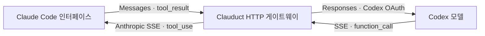

# Clauduct 게이트웨이 PoC

2026-09-06. **사용자 OAuth 실행 진입점 구현·로컬 검증 완료, 사용자 backend 결과 대기.** [사용자 실행 안내](./사용자-실행.md)의 명령으로 기존 OAuth를 메모리에서 연결한다. 아래 초기 게이트웨이 기록과 최신 전달·인증 연결 검증을 구별한다. 실제 OAuth·Claude 실행은 에이전트가 하지 않았다.

```powershell
Set-Location 'D:\AIDEV\Clauduct'
node --permission --allow-fs-read=D:\AIDEV\Clauduct\poc --allow-fs-read=D:\AIDEV\Clauduct\verification\manual-http-probe.mjs .\poc\test-gateway.mjs
```

기본 검사 **66/66**을 통과했다. `--real-timeouts`를 붙인 실행은 **67/67**, 게이트웨이 **65개** 정리, 클라이언트 HTTP 요청 **70개**, 합성 upstream 수신 **37개**를 관찰했다. 각 시나리오의 요청 수와 종료 자원 수를 따로 assertion으로 확인한다. 이 합계는 한 세션의 요청 수가 아니다.

## 1. 목표 구조와 이번 구현



도구 실행과 권한 판단은 Claude Code가 소유한다. 게이트웨이는 요청 변환·중계·결과 변환만 한다. 이번 통신 검사에서는 그림의 양 끝을 합성 HTTP 클라이언트와 합성 Codex 서버로 대신했다. 실제 파일·shell 도구를 실행하지 않았다.

사용자가 요청한 대로 Claude의 기존 OAuth 환경변수·플랜 설정 조사는 중단했다. 그 조사를 게이트웨이 코드 구현의 선행 조건으로 두지 않는다. OmniRoute의 직접 Codex 경로를 참고해 라우터 내부에서 OAuth Bearer와 account header를 구성하는 책임을 분리했다. 기존 Codex 로그인 유지가 우선이며 새 PKCE·device login·토큰 import·app-server 전환은 추가하지 않았다.

| 파일 | 구현 책임 |
|---|---|
| [gateway.mjs](./gateway.mjs) | 127.0.0.1 HTTP 수신, 일회 세션 인증, 경로/요청 검사, OfflineSession과 전송 연결, Anthropic SSE 응답, 취소·시간·요청 예산·종료 |
| [codex-transport.mjs](./codex-transport.mjs) | 고정 Codex HTTPS 목적지, OAuth/account 헤더, POST 전송, 응답 헤더/청크 전달, 크기/시간/재시도 금지, 소켓 정리 |
| [adapter.mjs](./adapter.mjs) | 기존 변환 핵심을 변경 없이 재사용. 텍스트·Read tool_use/tool_result·SSE 검증 |
| [test-gateway.mjs](./test-gateway.mjs) | 실제 loopback HTTP/TCP로 클라이언트 → 게이트웨이 → 합성 Codex 왕복과 실패 검사 |

OmniRoute의 [BaseExecutor.buildHeaders](../../_ref/OmniRoute/open-sse/executors/base.ts)에서 accessToken을 Bearer로 넣고, [CodexExecutor.buildHeaders](../../_ref/OmniRoute/open-sse/executors/codex.ts)에서 workspaceId를 chatgpt-account-id에 연결하는 구조를 다시 확인했다. Clauduct는 기존 프로젝트의 buildHeaders/selectCredential을 재사용했으며 OmniRoute를 수정하거나 코드를 복사하지 않았다.

## 2. 실제로 동작한 HTTP 왕복

1. 클라이언트가 Messages 요청을 게이트웨이에 보낸다. 게이트웨이는 세션 인증과 입력을 확인한 뒤 Responses JSON을 만든다.
2. 전송 계층이 합성 upstream에 HTTP POST 1회를 보낸다. function_call의 call_id와 완성된 Read 인수를 검증한 뒤 Anthropic tool_use SSE를 반환한다.
3. 클라이언트가 대응 tool_result를 보낸다. 게이트웨이는 이전 이력·ID·인수가 일치하는지 검사하고 function_call_output으로 변환한다.
4. HTTP POST 2회째에서 tool_choice=none을 사용한다. 최종 합성 marker 텍스트와 message_stop을 클라이언트가 받는다. 게이트웨이·전송·로컬 세션 인증을 종료한다.

거부된 도구 결과도 is_error=true로 보존한다. 게이트웨이가 도구 결과를 성공으로 바꾸거나 직접 Read를 실행하지 않는다. 잘못된 tool ID·세션 ID·이력은 두 번째 upstream 요청을 만들기 전에 거부한다. 텍스트만 완료하는 경우 upstream 1회로 종료한다.

## 3. 모듈 API와 인증 경계

| API | 계약 |
|---|---|
| createCodexTransport({credential, clientVersion}) | 메모리 내 accessToken/account와 검토 버전 0.153.4를 받는다. 전송 자체에는 인증 파일 읽기·로그인·refresh·쓰기가 없다. user-session.mjs가 사용자 확인 후 기존 캐시와 실제 CLI 버전 확인을 연결한다. 에이전트는 그 인증 경로를 실행하지 않음 |
| transport.send(raw, sink, signal) | 검증된 Responses JSON, begin/push를 가진 기존 변환 세션, AbortSignal을 받는다. 각 요청 전 기존 expiry/account sanity check를 재사용한다. 서명 검증을 했다고 주장하지 않음 |
| startGateway({transport, headerPolicy, limits}) | 신뢰하는 로컬 프로그램이 전송 객체를 주입한다. HTTP 요청이 transport·목적지·headerPolicy를 선택하지 못한다. 한 게이트웨이가 전송과 세션 수명을 소유 |
| gateway.clientHeaders() | 로컬 소유자가 같은 프로세스 메모리에서 받는 인증 헤더. 임의 세션 비밀은 로그·명령 인수·환경변수·임시 파일로 옮기지 않음. 객체 직렬화로 비밀이 자동 노출되지 않도록 함수로 제공 |
| gateway.close() / gateway.done | 활성 요청 취소, 실제 소켓 close 이벤트와 작업 종료를 기다린 뒤 정제 진단 반환. 종료 후 clientHeaders 호출은 실패 |
| createLoopbackCodexTransport(port) | 테스트 전용. 실제 자격증명을 받는 인수가 없으며 localhost와 고정 합성 Bearer/account만 사용. 공통 native HTTP 처리 코드를 검사 |

로컬 세션 비밀은 매번 난수 32바이트로 생성하며 고정 길이 비교에는 timingSafeEqual을 사용한다. 공개 요청 검사기의 marker는 이 게이트웨이에서 거부된다. 실제 Claude OAuth/Codex OAuth를 로컬 세션 비밀로 쓰지 않는다. 클라이언트 헤더를 upstream에 그대로 전달하지 않고 Codex 전송 계층이 자체 헤더를 만든다.

루프백 전송은 변환기의 고정 Codex 프로토콜을 검사하기 위해 endpoint 메타데이터에 그 프로토콜 식별자를 제공한다. **실제 네트워크 목적지는 127.0.0.1이며 diagnostics.synthetic=true다.** 이것은 OpenAI 목적지·인증·TLS의 관찰 증거가 아니다. 실제 전송 factory는 HTTPS 목적지도 고정 https://chatgpt.com/backend-api/codex/responses다.

모듈 import만으로 로그인·서버 시작·외부 전송은 발생하지 않는다. 사용자 CLI는 user-session.mjs로 분리했다. --live-tool-roundtrip은 사용자 TTY·SEND 확인 뒤에만 고정 인증 경로를 사용하며, 에이전트의 기존 거부를 우회하는 경로가 아니다. OAuth 문자열의 참조 해제는 managed 메모리의 즉시 완전 소거를 보장하지 않는다.

## 4. 경로·지원 범위·고정 한도

| 대상 | 구현 |
|---|---|
| 바인딩 | 127.0.0.1, OS 할당 port. 정확한 Host, Origin/Sec-Fetch/forwarded 차단 |
| HEAD /api/hello | 204, upstream 없음. 인증을 생략할 수 있지만 제공하면 일치해야 함 |
| POST /v1/messages?beta=true | 로컬 Bearer 세션 인증 필요. pathname으로 경로 분류 |
| POST /v1/messages/count_tokens | 고정 404. token 수를 위조하거나 upstream 호출로 대체하지 않음 |
| 모델·도구 계약 | 기존 clauduct-poc 별칭, stream=true, text/system과 합성 Read 스키마 1개만 지원. gpt-6-astra/xhigh 고정 |
| API version/beta | anthropic-version=2023-06-01 요구. 의미를 구현하지 않은 anthropic-beta 헤더는 upstream 전송 전 거부. query의 beta=true와 구별 |
| 입력/응답 | 요청 64 KiB, upstream 256 KiB, 헤더 8 KiB. 기존 도구 인수/이벤트 한도 유지 |
| 세션·동시성 | 한 세션, 한 진행 중 Messages 요청, session ID 값과 존재 결합. subagent 거부 |
| 요청 예산 | gateway HTTP 최대 8회 후 다음 요청 거부·종료. 실제 upstream POST 최대 2회 |
| 연결 예산 | 수용 연결 최대 16개 후 다음 연결 폐기·종료. 동시 연결 최대 4개 |
| 기본 시간 | 전체 게이트웨이 180초, 클라이언트 요청 5초, upstream 45초, 도구 결과 대기 45초, 하류 전달 5초. 테스트에서 줄일 수 있으나 늘릴 수 없음 |
| 리다이렉트/재시도 | native client + agent=false. Location 미추적, 재시도·refresh·모델 대체 없음 |
| 스트리밍 | upstream 전체 검증 후 SSE 반환. 16 KiB 청크와 write/drain backpressure·기본 5초 제한 적용. backend 생성 중 실시간 delta는 미구현 |

현재 지원 입력은 합성 PoC 계약이다. 실제 Claude의 일반 요청 전체를 받을 수 있다고 주장하지 않는다. 의미가 다른 필드를 버려서 통과시키지 않았으며 실제 backend의 max_output_tokens·reasoning·도구 계약도 미검증이다. 이 호환성 확장은 게이트웨이 구현 이후의 별도 수용 작업이다.

하류 SSE 쓰기의 finish는 로컬 writable 완료이며 Claude의 파싱·표시·도구 실행 완료가 아니다. 작은 Node PassThrough 버퍼에서 backpressure·재개·취소·기본 5초 만료를 관찰했다. 실제 느린 TCP 클라이언트의 장시간 정체는 유발하지 않았다.

## 5. 실패·취소와 헤더 정책

upstream 401/403/429/redirect/HTTP 오류는 정제된 502 오류로 내려주고 해당 게이트웨이를 종료한다. 로컬 세션 인증 실패의 401과 구별한다. HTTP 오류 본문·임의 예외·토큰·응답 원문을 오류 메시지로 전달하지 않는다. 클라이언트의 재접속이 있더라도 종료된 전송으로 추가 모델 요청을 만들지 않는다.

Content-Type은 기본 strict다. 명시적으로 headerPolicy=codex-missing-content-type을 선택한 경우에만 정확한 endpoint/200/필드 부재에서 기존 본문 검증을 진행한다. 빈 필드·다른 media type·오류·미완료 본문은 거부한다. 원래 사용자 비교 검사의 MISSING_CONTENT_TYPE FAIL은 바뀌지 않는다.

클라이언트 연결 중단, 요청/전송/도구 결과 시간 초과, 호출자 종료는 현재 upstream을 취소하고 소켓을 닫는다. 정상 전송 뒤의 close는 취소로 오인하지 않는다. 초과한 청크 요청처럼 이미 소켓이 폐기된 경우에는 오류 JSON을 보낼 수 없으므로 정제 종료 사유만 남긴다. 예상하지 못한 내부 예외도 원문 대신 GATEWAY_FAILED로 종료하며 검사에서 internalErrors=0을 요구한다.

## 6. 관찰 결과와 남은 작업

**Verified:** 최신 사용자 진입점 44/44, 게이트웨이 72/72·66개 검증 세션 정리. upstream 45초는 45,016 ms, 전달 함수 5초는 5,010 ms에 만료했다. 앞선 시간 검사에서는 180초 전체 수명이 180,014 ms에 끝났다. 해당 시간 코드 변경이 없어 180초는 반복하지 않았다. 변환 100/100, 요청 검사기 82/82, 연결 파서 77/77 및 변경 JS 구문·인증 없는 --help를 확인했다.

검사에는 정상 텍스트·도구 2회 왕복·권한 거부 데이터 보존, ID/세션 변조, 실제 자격증명 모양의 입력 거부, HTTP 오류, 301/302/303/307/308/421/429 수신 횟수, Content-Type strict/opt-in, 응답 초과/절단/UTF-8/미완료, 요청 크기·시간·동시성·연결 상한, 중복 헤더/프레이밍 충돌/Expect/upgrade/pipeline, 헤더 전·본문 중 취소와 원문 비노출이 포함된다. 양 끝은 합성 데이터이며 OS 전체 통신 감사는 아니다.

초기 56개 중 8개가 실패했다. 정상 응답 finish/close 순서, socket.closed와 실제 close 이벤트의 차이, 폐기된 소켓의 오류 응답 처리를 고쳤다. 추가 크기 검사에서 드러난 null socket 접근도 수정했다. 실패 검사를 삭제하거나 기존 성공 조건을 완화하지 않았다.

**Not verified:** 실제 사용자 TTY/SEND·CLI 버전 확인·OAuth 읽기·OpenAI TLS·backend 도구 계약, 실제 Claude 요청/도구/재요청, CLI 비밀 전달, backend 생성 중 실시간 delta, 느린 실제 TCP 하류 정체, listen 실패 등 OS 오류 전체. 새 시간 검사를 이전 Node 라이브 검사기의 전체 경로 증거로 쓰지 않는다.

**Blocked by:** 기존 credential-path 거부로 에이전트의 실제 인증 사용은 계속 금지된다. 사용자 운영 진입점과 같은 프로세스 메모리 클라이언트는 구현했지만 실제 계정 결과를 기다린다. 실제 Claude로의 비밀 전달은 별도 미통합 항목이다. 기존 TTY 거부도 우회하지 않았으며 Claude 설정 추가 조사를 게이트웨이 구현 조건으로 요구하지 않는다.

다음 수용 작업은 [사용자 실행 진입점](./사용자-실행.md)의 정제 결과 분석이다. 새 자체 검사 요청은 출력 토큰 한도를 포함하지 않는다. 외부 클라이언트의 명시적 한도는 전송 전에 TOKEN_LIMIT_UNSUPPORTED로 거부하므로 실제 Claude의 max_tokens 호환은 별도 미해결이다. refresh·인증 쓰기·도구 직접 실행은 추가하지 않는다.
